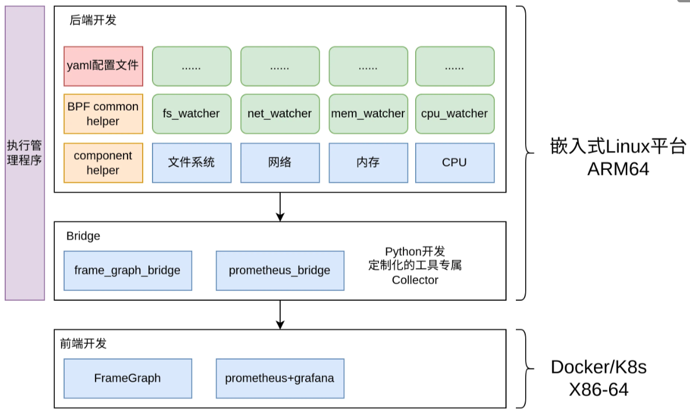

# ksight

## 1. 简介

一款用于Linux内核的可观测性定制命令行工具，覆盖CPU、内存、网络、IPC、文件、虚拟化等子系统。

ksight 洞见内核

ksight family：
- [ksight](https://github.com/ziyangfu/ksight)：Linux内核可观测性定制工具。命令行，后端，可单独使用，正在开发中
- [ksight-lite](https://github.com/ziyangfu/ksight-lite)：针对RTOS(AUTOSAR OS?)的可观测性定制工具。命令行，后端，可单独使用，计划开发中
- [ksight-ui](https://github.com/ziyangfu/ksight-ui)： 跨平台应用软件（可能支持Windows），时间序列图表可视化，可交互。前端，与后端配套，计划开发中。

母项目直达：[lmp](https://github.com/linuxkerneltravel/lmp)

## 2. 架构



## 3. 目前已有的工具

- 文件系统部分
  - [x] fs_watcher

- 内存部分
  - [x] mem_watcher

- 网络部分
  - [x] net_watcher
- IPC
  - [x] ipc_watcher

- CPU部分
  - [x] cpu_watcher
  - [x] proc_image

- 虚拟化部分
  - [x] kvm_watcher

- 系统诊断与调优
  - [x] stack_analyzer


## 4. 编译安装
### 4.1 单独安装ksight
```bash
git clone --recurse-submodules <ksight_github_address>
mkdir build && cd build
# -------------------------------------------------------
# 若想要编译所有工具
cmake -DBUILD_ALL=ON -DCMAKE_INSTALL_PREFIX=<install_dir> ..
# 若想要编译单独某个工具，如 fs_watcher
cmake -DBUILD_FS_WATCHER=ON ..
# 若想在x64平台交叉编译出arm64平台的程序（TARCH 即 target arch）
cmake -DBUILD_ALL=ON -DTARCH=arm64 ..
# -------------------------------------------------------
make
make install
```
### 4.2 安装ksight family
使用repo安装多仓库，TODO
