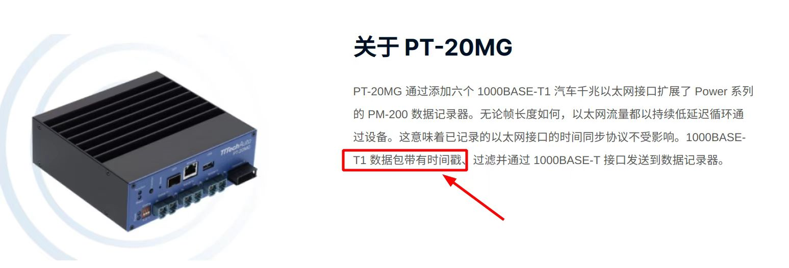
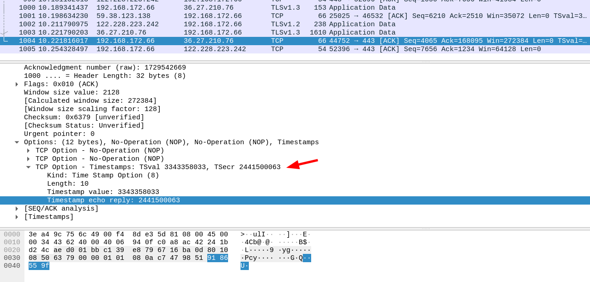

使用tcp_timestamp实现端到端时间延迟测量



Linux内核中tcp_timestamp默认是开启的

```c
// net/ipv4/tcp_ipv4.c

static int __net_init tcp_sk_init(struct net *net)
{
    // ...
    net->ipv4.sysctl_max_syn_backlog = max(128, cnt / 128);
	net->ipv4.sysctl_tcp_sack = 1;
	net->ipv4.sysctl_tcp_window_scaling = 1;
	net->ipv4.sysctl_tcp_timestamps = 1;    // 默认是开启的
	net->ipv4.sysctl_tcp_early_retrans = 3;
	net->ipv4.sysctl_tcp_recovery = TCP_RACK_LOSS_DETECTION;
    // ...
}
```


```c
// net/ipv4/tcp_ipv4.c

static void tcp_v4_send_ack(const struct sock *sk,
			    struct sk_buff *skb, u32 seq, u32 ack,
			    u32 win, u32 tsval, u32 tsecr, int oif,
			    struct tcp_md5sig_key *key,
			    int reply_flags, u8 tos)
{
	const struct tcphdr *th = tcp_hdr(skb);
	struct {
		struct tcphdr th;
		__be32 opt[(TCPOLEN_TSTAMP_ALIGNED >> 2)
#ifdef CONFIG_TCP_MD5SIG
			   + (TCPOLEN_MD5SIG_ALIGNED >> 2)
#endif
			];
	} rep;
    // ...
    // 如果发送者带时间戳，接受者回ack时，也会把数据写到 opt中
    if (tsecr) {
		rep.opt[0] = htonl((TCPOPT_NOP << 24) | (TCPOPT_NOP << 16) |
				   (TCPOPT_TIMESTAMP << 8) |
				   TCPOLEN_TIMESTAMP);
		rep.opt[1] = htonl(tsval);   // 发送端发送这个数据包的时间戳
		rep.opt[2] = htonl(tsecr);   // 接收端发送 ack 响应时的时间戳
		arg.iov[0].iov_len += TCPOLEN_TSTAMP_ALIGNED;
	}  
    // ...
}
```



tcp_options_received 结构体包含在 tcp_sock结构体中

```c
// include/linux/tcp.h
struct tcp_options_received {
/*	PAWS/RTTM data	*/
	int	ts_recent_stamp;/* Time we stored ts_recent (for aging) */
	u32	ts_recent;	/* Time stamp to echo next		*/
	u32	rcv_tsval;	/* Time stamp value             	*/
	u32	rcv_tsecr;	/* Time stamp echo reply        	*/
	u16 	saw_tstamp : 1,	/* Saw TIMESTAMP on last packet		*/
		tstamp_ok : 1,	/* TIMESTAMP seen on SYN packet		*/
		dsack : 1,	/* D-SACK is scheduled			*/
		wscale_ok : 1,	/* Wscale seen on SYN packet		*/
		sack_ok : 3,	/* SACK seen on SYN packet		*/
		smc_ok : 1,	/* SMC seen on SYN packet		*/
		snd_wscale : 4,	/* Window scaling received from sender	*/
		rcv_wscale : 4;	/* Window scaling to send to receiver	*/
	u8	saw_unknown:1,	/* Received unknown option		*/
		unused:7;
	u8	num_sacks;	/* Number of SACK blocks		*/
	u16	user_mss;	/* mss requested by user in ioctl	*/
	u16	mss_clamp;	/* Maximal mss, negotiated at connection setup */
};
```

解析接收包的tcp_options字段

```c
// net/ipv4/tcp_input.c

/* Look for tcp options. Normally only called on SYN and SYNACK packets.
 * But, this can also be called on packets in the established flow when
 * the fast version below fails.
 */
void tcp_parse_options(const struct net *net,
		       const struct sk_buff *skb,
		       struct tcp_options_received *opt_rx, int estab,
		       struct tcp_fastopen_cookie *foc)
{}
```

写入tcp_options字段

```c
// net/ipv4/tcp_output.c

/* Write previously computed TCP options to the packet.
 *
 * Beware: Something in the Internet is very sensitive to the ordering of
 * TCP options, we learned this through the hard way, so be careful here.
 * Luckily we can at least blame others for their non-compliance but from
 * inter-operability perspective it seems that we're somewhat stuck with
 * the ordering which we have been using if we want to keep working with
 * those broken things (not that it currently hurts anybody as there isn't
 * particular reason why the ordering would need to be changed).
 *
 * At least SACK_PERM as the first option is known to lead to a disaster
 * (but it may well be that other scenarios fail similarly).
 */
static void tcp_options_write(__be32 *ptr, struct tcp_sock *tp,
			      struct tcp_out_options *opts)
{}
```


在没有TSN时间同步的情况下，可以使用TCP层RTT测量

如存在TSN时间同步，可以精准测量TCP-TCP单向时间延迟