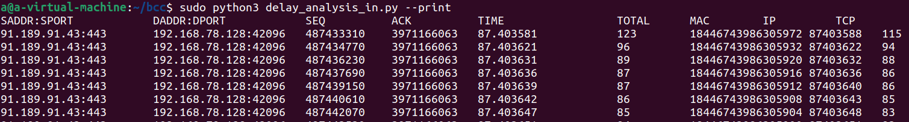

# delay_analysis-BCC代码

本周工作：阅读bcc_version版本delay_analysis代码

下周工作：移植代码，阅读论文《容器网络监控技术的设计和实现》

实时输出所有接收包信息及内核各层处理过程所花费的时间。

参数如下：

```
--sport
    [可选] 指定源端口
--dport
    [可选] 指定目标端口
-s, --sample
    [可选] 随机选包进行输出
-c, --count
    [可选] 输出条数，默认为99999999
--print
    [可选] 在命令行打印结果
--visual
    [可选] 将结果通过influxdb-grafana可视化
```



SADDR : SPORT    IP头的字段，来源端口

DADDR : DPORT     IP头的字段， 目的端口

SEQ:   tcp包的序列号

ACK:    网络包的确认号

TIME：传输时间

TOTAL：TCP报文长度

MAC：网络设备的MAC位置

IP：IP地址

TCP：传输控制协议

## 内核

```
#include <uapi/linux/ptrace.h>
#include <linux/tcp.h>
#include <linux/ip.h>
#include <uapi/linux/tcp.h>
#include <uapi/linux/ip.h>
#include <uapi/linux/if_ether.h>
#include <net/sock.h>
#include <bcc/proto.h>
#include <linux/skbuff.h>
#include <linux/netdevice.h>
#include <net/tcp.h>
#include <net/ip.h>


struct packet_tuple {
    u32 saddr;
    u32 daddr;
    u16 sport;
    u16 dport;
    u32 seq;
    u32 ack;
};

struct ktime_info {
    u64 mac_time;
    u64 ip_time;
    u64 tcp_time;
    u64 app_time;
};

struct data_t {
    u64 total_time;
    u64 mac_timestamp;
    u64 mac_time;
    u64 ip_time;
    u64 tcp_time;
    u32 saddr;
    u32 daddr;
    u16 sport;
    u16 dport;
    u32 seq;
    u32 ack;
};

#定义保存中间数据的map，映射名 in_timestamps,key和value是struct packet_tuple, struct ktime_info
BPF_HASH(in_timestamps, struct packet_tuple, struct ktime_info);

#BPF_PERF_OUTPUT 机制来实现数据的传递，定义用于通信的 perf_event 对象
BPF_PERF_OUTPUT(timestamp_events);

#tcphdr是TCP包头结构体，从中读取数据
static struct tcphdr *skb_to_tcphdr(const struct sk_buff *skb){
    return (struct tcphdr *)(skb->head + skb->transport_header);
}

#iphdr是ip数据包的描述结构体
static inline struct iphdr *skb_to_iphdr(const struct sk_buff *skb){
    return (struct iphdr *)(skb->head + skb->network_header);
}

#填充map数据
static void get_pkt_tuple(struct packet_tuple *pkt_tuple, struct iphdr *ip, struct tcphdr *tcp){
    pkt_tuple->saddr = ip->saddr;
    pkt_tuple->daddr = ip->daddr;
    u16 sport = tcp->source;
    u16 dport = tcp->dest;
    pkt_tuple->sport = ntohs(sport);
    pkt_tuple->dport = ntohs(dport);
    u32 seq = tcp->seq;
    u32 ack = tcp->ack_seq;
    pkt_tuple->seq = ntohl(seq);
    pkt_tuple->ack = ntohl(ack);
} 

#动态跟踪eth_type_trans
int kprobe__eth_type_trans(struct pt_regs *ctx, struct sk_buff *skb){
#ethhdr结构体来表示以太网帧的头部
    const struct ethhdr* eth = (struct ethhdr*) skb->data;
    #获取网络层所使用的协议类型
    u16 protocol = eth->h_proto;

    if (protocol == 8){ // Protocol is IP
    #data和tail分别是真正数据的起始位结束。
        struct iphdr *ip = (struct iphdr *)(skb->data + 14);
        // TODO options in hdr
        struct tcphdr *tcp = (struct tcphdr *)(skb->data + 34);
        struct packet_tuple pkt_tuple = {};
        #更新数据
        get_pkt_tuple(&pkt_tuple, ip, tcp);
        
        ##SAMPLING##
        ##FILTER_DPORT##
        ##FILTER_SPORT##

        struct ktime_info *tinfo, zero={}; 
        if ((tinfo = in_timestamps.lookup_or_try_init(&pkt_tuple, &zero)) == NULL){
            return 0;
        }
        tinfo->mac_time = bpf_ktime_get_ns();
    }

    return 0;
}

// int kprobe__ip_rcv(struct pt_regs *ctx, struct sk_buff *skb){
// int kprobe__ip_rcv_core(struct pt_regs *ctx, struct sk_buff *skb){
int kernel_kprobe_ip_rcv_core(struct pt_regs *ctx, struct sk_buff *skb){
    if (skb == NULL){
        return 0;
    }
    
    struct iphdr *ip = skb_to_iphdr(skb);
    struct tcphdr *tcp = skb_to_tcphdr(skb);
    struct packet_tuple pkt_tuple = {};
    get_pkt_tuple(&pkt_tuple, ip, tcp);

    ##SAMPLING##
    ##FILTER_DPORT##
    ##FILTER_SPORT##

    struct ktime_info *tinfo;
    if ((tinfo = in_timestamps.lookup(&pkt_tuple)) == NULL){
        return 0;
    }
    
    tinfo->ip_time = bpf_ktime_get_ns();
    
    return 0;
}

int kprobe__tcp_v4_rcv(struct pt_regs *ctx, struct sk_buff *skb){
    if (skb == NULL)
        return 0;
    struct iphdr *ip = skb_to_iphdr(skb);
    struct tcphdr *tcp = skb_to_tcphdr(skb);
    struct packet_tuple pkt_tuple = {};
    get_pkt_tuple(&pkt_tuple, ip, tcp);

    ##SAMPLING##
    ##FILTER_DPORT##
    ##FILTER_SPORT##

    struct ktime_info *tinfo;
    if ((tinfo = in_timestamps.lookup(&pkt_tuple)) == NULL){
        return 0;
    }
    tinfo->tcp_time = bpf_ktime_get_ns();
    
    return 0;
}

int kprobe__skb_copy_datagram_iter(struct pt_regs *ctx, struct sk_buff *skb){
    if (skb == NULL)
        return 0;
    struct iphdr *ip = skb_to_iphdr(skb);
    struct tcphdr *tcp = skb_to_tcphdr(skb);
    struct packet_tuple pkt_tuple = {};
    #更新数据
    get_pkt_tuple(&pkt_tuple, ip, tcp);

    ##SAMPLING##
    ##FILTER_DPORT##
    ##FILTER_SPORT##
    
    struct ktime_info *tinfo;
    if ((tinfo = in_timestamps.lookup(&pkt_tuple)) == NULL){
        return 0;
    }

    tinfo->app_time = bpf_ktime_get_ns();
    struct data_t data = {};
    data.mac_timestamp = tinfo->mac_time;
    data.total_time = tinfo->app_time - tinfo->mac_time;
    data.mac_time = tinfo->ip_time - tinfo->mac_time;
    data.ip_time = tinfo->tcp_time - tinfo->ip_time;
    data.tcp_time = tinfo->app_time - tinfo->tcp_time;

    data.saddr = pkt_tuple.saddr;
    data.daddr = pkt_tuple.daddr;
    data.sport = pkt_tuple.sport;
    data.dport = pkt_tuple.dport;
    data.seq = pkt_tuple.seq;
    data.ack = pkt_tuple.ack;
  
    in_timestamps.delete(&pkt_tuple);
    #提交数据
    timestamp_events.perf_submit(ctx, &data, sizeof(data));
    return 0;
}
```

```
sudo python delay_analysis_in.py --print                # in packets delay analysis
sudo python delay_analysis_in.py --print --sport 181    # only trace dport 181
sudo python delay_analysis_in.py --print -s             # print random packets
```

```
struct iphdr {
#if defined(__LITTLE_ENDIAN_BITFIELD) //小端模式下
    __u8 ihl:4,//首部长度(4位)
        version:4;//ip协议版本IPv4
#elif defined (__BIG_ENDIAN_BITFIELD) //大端模式下
    __u8 version:4,
        ihl:4;
#else
#error "Please fix <asm/byteorder.h>"
#endif
    __u8 tos;//服务类型字段(8位)
    __be16 tot_len;//16位IP数据报总长度
    __be16 id;//16位标识字段（唯一表示主机发送的每一分数据报）
    __be16 frag_off;//(3位分段标志+13位分段偏移数)
    __u8 ttl;//8位数据报生存时间
    __u8 protocol;//协议字段（8位）
    __be16 check;//16位首部校验
    __be32 saddr; //源IP地址
    __be32 daddr; //目的IP地址
};

iphdr->version
    版本(4位)，目前的协议版本号是4,因此IP有时也称作IPv4。

iphdr->ihl
    首部长度(4位):首部长度指的是IP层头部占32 bit字的数目(也就是IP层头部包含多少个4字节 – 32位),包括任何选项。由于它是一个4比特字段,因此首部最长为60个字节。普通IP数据报(没有任何选择项)字段的值是5 <==> 5 * 32 / 8 = 5 * 4 = 20 Bytes。

iphdr->tos
    服务类型字段(8位): 服务类型(TOS)字段包括一个3 bit的优先权子字段(现在已被忽略)，4 bit的TOS子字段和1 bit未用位但必须置0。4 bit的TOS子字段分别代表:最小时延、最大吞吐量、最高可靠性和最小费用。4 bit中只能设置其中1 bit。如果所有4 bit均为0,那么就意味着是一般服务。

iphdr->tot_len
    总长度字段(16位)是指整个IP数据报的长度,以字节为单位。利用首部长度字段和总长度字段,就可以知道 IP数据报中数据内容的起始位置和长度。由于该字段长16比特,所以IP数据报最长可达65535字节，总长度字段是IP首部中必要的内容,因为一些数据链路(如以太网)需要填充一些数据以达到最小长度。尽管以太网的最小帧长为46字节,但是IP数据可能会更短。如果没有总长度字段,那么IP层就不知道46字节中有多少是IP数据报的内容。

iphdr->id
    标识字段(16位)唯一地标识主机发送的每一份数据报。通常每发送一份报文它的值就会加1。

iphdr->frag_off (16位)
    frag_off域的低13位 – 分段偏移(Fragment offset)域指明了该分段在当前数据报中的什么位置上。除了一个数据报的最后一个分段以外，其他所有的分段(分片)必须是8字节的倍数。这是8字节是基本分段单位。由于该域有13个位，所以，每个数据报最多有8192个分段。因此，最大的数据报长度为65,536字节，比iphdr->tot_len域还要大1。
    iphdr->frag_off的高3位
        (1) 比特0是保留的，必须为0；
        (2) 比特1是“不分片”(DF – Don’t Fragment)标志,如果将这一比特置1，IP将不对数据报进行分片,这时如果有需要进行分片的数据报到来，会丢弃此数据报并发送一个ICMP差错报文给起始端。
        (3) 比特2是“更多分片”(MF – More Fragment)标志。除了最后一片外，其他每个组成数据报的片都要把该比特置1。

iphdr->ttl
    TTL(time-to-live) – 8位，生存时间字段设置了数据报可以经过的最多路由器数。它指定了数据报的生存时间。TTL的初始值由源主机设置(通常为32或64),一旦经过一个处理它的路由器,它的值就减去1。当该字段的值为0时,数据报就被丢弃,并发送ICMP报文通知源主机。
    TTL(Time to live)域是一个用于限制分组生存期的计数器。这里的计数时间单位为秒，因此最大的生存期为255秒。在每一跳上该计数器必须被递减，而且，当数据报在一台路由器上排队时间较长时，该计数器必须被多倍递减。在实践中，它只是跳计数器，当它递减到0的时候，分组被丢弃，路由器给源主机发送一个警告分组。此项特性可以避免数据报长时间地逗留在网络中，有时候当路由表被破坏之后，这种事情是有可能发生的。

iphdr->protocol
    协议字段(8位): 根据它可以识别是哪个协议向IP传送数据。当网络层组装完成一个完整的数据报之后，它需要知道该如何对它进行处理。协议(Protocol)域指明了该将它交给哪个传输进程。TCP是一种可能，但是UDP或者其他的协议也是可能的。

iphdr->check
    首部检验和字段(16位)是根据IP首部计算的检验和码。它不对首部后面的数据进行计算。 ICMP、IGMP、UDP和TCP在它们各自的首部中均含有同时覆盖首部和数据检验和码。
为了计算一份数据报的IP检验和,首先把检验和字段置为0。然后,对首部中每个16 bit进行二进制反码求和(整个首部看成是由一串16 bit的字组成),结果存在检验和字段中。当收到一份IP数据报后,同样对首部中每个16 bit进行二进制反码的求和。由于接收方在计算过程中包含了发送方存在首部中的检验和,因此,如果首部在传输过程中没有发生任何差错,那么接收方计算的结果应该为全1。如果结果不是全1(即检验和错误),那么IP就丢弃收到的数据报。但是不生成差错报文,由上层去发现丢失的数据报并进行重传。

iphdr->saddr
    32位源IP地址
iphdr->daddr
    32位目的IP地址

网络字节序
    4个字节的32 bit值以下面的次序传输:首先是0~7bit,其次8~15bit,然后16~23bit,最后是24~31 bit。这种传输次序称作big endian字节序。由于TCP/IP首部中所有的二进制整数在网络中传输时都要求以这种次序,因此它又称作网络字节序。

struct tcphdr {
    __be16 source;
    __be16 dest;
    __be32 seq;
    __be32 ack_seq;
#if defined(__LITTLE_ENDIAN_BITFIELD)
    __u16   res1:4,
            doff:4,
            fin:1,
            syn:1,
            rst:1,
            psh:1,
            ack:1,
            urg:1,
            ece:1,
            cwr:1;
#elif defined(__BIG_ENDIAN_BITFIELD)
    __u16   doff:4,
            res1:4,
            cwr:1,
            ece:1,
            urg:1,
            ack:1,
            psh:1,
            rst:1,
            syn:1,
            fin:1;
#else
#error "Adjust your defines"
#endif
    __be16 window;
    __be16 check;
    __be16 urg_ptr;
};
tcphdr->source
    16位源端口号

tcphdr->dest
    16位目的端口号

tcphdr->seq
    表示此次发送的数据在整个报文段中的起始字节数。序号是32 bit的无符号数。为了安全起见，它的初始值是一个随机生成的数，它到达32位最大值后，又从零开始。

tcphdr->ack_seq
    指定的是下一个期望接收的字节，而不是已经正确接收到的最后一个字节。

tcphdr->doff
    TCP头长度，指明了在TCP头部包含多少个32位的字。此信息是必须的，因为options域的长度是可变的，所以整个TCP头部的长度也是变化的。从技术上讲，这个域实际上指明了数据部分在段内部的其起始地址(以32位字作为单位进行计量)，因为这个数值正好是按字为单位的TCP头部的长度，所以，二者的效果是等同的

tcphdr->res1为保留位

tcphdr->window
    是16位滑动窗口的大小，单位为字节，起始于确认序列号字段指明的值，这个值是接收端正期望接收的字节数，其最大值是63353字节。
    TCP中的流量控制是通过一个可变大小的滑动窗口来完成的。window域指定了从被确认的字节算起可以接收的多少个字节。window = 0也是合法的，这相当于说，到现在为止多达ack_seq-1个字节已经接收到了，但是接收方现在状态不佳，需要休息一下，等一会儿再继续接收更多的数据，谢谢。以后，接收方可以通过发送一个同样ack_seq但是window不为0的数据段，告诉发送方继续发送数据段。

tcphdr->check
    是检验和，覆盖了整个的TCP报文段，这是一个强制性的字段，一定是由发送端计算和存储，并由接收端进行验证。

tcphdr->urg_ptr
    这个域被用来指示紧急数据在当前数据段中的位置，它是一个相对于当前序列号的字节偏移值。这个设施可以代替中断信息。 
   
fin, syn, rst, psh, ack, urg为6个标志位
    这6个位域已经保留了超过四分之一个世纪的时间而仍然原封未动，这样的事实正好也说明了TCP的设计者们考虑的是多么的周到。它们的含义如下：
    tcphdr->fin fin位被用于释放一个连接。它表示发送方已经没有数据要传输了。
    tcphdr->syn 同步序号，用来发起一个连接。syn位被用于建立连接的过程。在连接请求中，syn=1; ack=0表示该数据段没有使用捎带的确认域。连接应答捎带了一个确认，所以有syn=1; ack=1。本质上，syn位被用来表示connection request和connection accepted，然而进一步用ack位来区分这两种情况。 
    tcphdr->rst 该为用于重置一个已经混乱的连接，之所以会混乱，可能是由于主机崩溃，或者其他的原因。该位也可以被用来拒绝一个无效的数据段，或者拒绝一个连接请求。一般而言，如果你得到的数据段设置了rst位，那说明你这一端有了问题。 
    tcphdr->psh 接收方在收到数据后应立即请求将数据递交给应用程序，而不是将它缓冲起来直到整个缓冲区接收满为止(这样做的目的可能是为了效率的原因) 
    tcphdr->ack ack位被设置为1表示tcphdr->ack_seq是有效的。如果ack为0，则该数据段不包含确认信息，所以，tcphdr->ack_seq域应该被忽略。 
    tcphdr->urg 紧急指针有效 

    tcphdr->ece 用途暂时不明
    tcphdr->cwr 用途暂时不明
    内核源代码在函数tcp_transmit_skb()中建立tcp首部。
    
skb函数
struct sk_buff {

__u16 transport_header; //传输头相对于skb->head的偏移

__u16 network_header;//网络头相对于skb->head的偏移

__u16 mac_header;//以太网头相对于skb->head的偏移

/* These elements must be at the end, see alloc_skb() for details. */

sk_buff_data_t tail;

sk_buff_data_t end;

unsigned char *head, *data;

}
head和end分别指向存放数据内存区域的头和尾，一旦分配就固定不变。

data和tail分别是真正数据的起始位结束。
```

```
#define ETH_ALEN 6  //定义了以太网接口的MAC地址的长度为6个字节

#define ETH_HLAN 14  //定义了以太网帧的头长度为14个字节

#define ETH_ZLEN 60  //定义了以太网帧的最小长度为 ETH_ZLEN + ETH_FCS_LEN = 64个字节

#define ETH_DATA_LEN 1500  //定义了以太网帧的最大负载为1500个字节

#define ETH_FRAME_LEN 1514  //定义了以太网正的最大长度为ETH_DATA_LEN + ETH_FCS_LEN = 1518个字节

#define ETH_FCS_LEN 4   //定义了以太网帧的CRC值占4个字节


struct ethhdr
{
    unsigned char h_dest[ETH_ALEN]; //目的MAC地址
    
    unsigned char h_source[ETH_ALEN]; //源MAC地址
    
    __u16 h_proto ; //网络层所使用的协议类型
}__attribute__((packed))  //用于告诉编译器不要对这个结构体中的缝隙部分进行填充操作；
```

## 用户

```
from __future__ import print_function

import os
import sys

sys.path.append(os.path.realpath("../visual"))

import argparse
from socket import inet_ntop, AF_INET
from struct import pack

from bcc import BPF


#argparse 模块是 Python 内置的一个用于命令项选项与参数解析的模块argparse 模块可以让人轻松编写用户友好的命令行接口。
三个步骤：

1、创建一个解析器——创建 ArgumentParser() 对象
2、添加参数——调用 add_argument() 方法添加参数
3、解析参数——使用 parse_args() 解析添加的参数
action：该参数的操作。
help：该参数的帮助信息。
############## arguments #################
parser = argparse.ArgumentParser(description="Trace time delay in network subsystem",
    formatter_class=argparse.RawDescriptionHelpFormatter)
parser.add_argument("--sport", help="trace this source port only")
parser.add_argument("--dport", help="trace this destination port only")
parser.add_argument("-s", "--sample", help="Trace sampling")
parser.add_argument("-c", "--count", type=int, default=99999999, help="count of outputs")
parser.add_argument("--print", action="store_true", help="print results to terminal")
parser.add_argument("--visual", action="store_true", help="enable visualization with influxdb-grafana")
#属性给与args实例： 把parser中设置的所有"add_argument"给返回到args子类实例当中， 那么parser中增加的属性内容都会在args实例中，使用即可。
args = parser.parse_args()

bpf_text = open('delay_analysis_in.c').read()

#replace() 方法用另一个指定的短语替换一个指定的短语。string.replace(oldvalue, newvalue, count)
参数	       描述
oldvalue	必需。要检索的字符串。
newvalue	必需。替换旧值的字符串。
count	    可选。数字，指定要替换的旧值出现次数。默认为所有的出现。

#过滤条件
# -------- code substitutions --------
if args.sport:
    bpf_text = bpf_text.replace('##FILTER_SPORT##', 'if (pkt_tuple.sport != %s) { return 0; }' % args.sport)
    
if args.dport:
    bpf_text = bpf_text.replace('##FILTER_DPORT##', 'if (pkt_tuple.dport != %s) { return 0; }' % args.dport)
    
if args.sample:
    bpf_text = bpf_text.replace('##SAMPLING##', 'if (((pkt_tuple.seq + pkt_tuple.ack + skb->len) << (32-%s) >> (32-%s)) != ((0x01 << %s) - 1)) { return 0;}' % (args.sample, args.sample, args.sample))

if args.visual:
    from utils import export_delay_analysis_in

bpf_text = bpf_text.replace('##FILTER_SPORT##', '')
bpf_text = bpf_text.replace('##FILTER_DPORT##', '')
bpf_text = bpf_text.replace('##SAMPLING##', '')


#定义处理函数
################## printer for results ###################
def print_event(cpu, data, size):

#定义事件处理timestamp_events然后读取出对应的数据并生成结构数据 。
    event = b["timestamp_events"].event(data)
    if args.print:
        print("%-22s %-22s %-12s %-12s %-20s %-10s %-10s %-10s %-10s" % (
            "%s:%d" % (inet_ntop(AF_INET, pack('I', event.saddr)), event.sport),
            "%s:%d" % (inet_ntop(AF_INET, pack('I', event.daddr)), event.dport),
            "%d" % (event.seq),
            "%d" % (event.ack),
            "%f" % (event.mac_timestamp*1e-9),
            "%d" % (event.total_time/1000),
            "%d" % (event.mac_time/1000),
            "%d" % (event.ip_time/1000),
            "%d" % (event.tcp_time/1000)
        ))
    if args.visual:
        export_delay_analysis_in(event)

#内核挂载函数
################## start tracing ##################
b = BPF(text=bpf_text)
# adapte "ip_rcv_core" and "ip_crv_core.isra." via regular expression
b.attach_kprobe(event_re="^ip_rcv_core$|^ip_rcv_core\.isra\.\d$", fn_name="kernel_kprobe_ip_rcv_core")

if args.print:
    # -------- print header --------
    print("%-22s %-22s %-12s %-12s %-20s %-10s %-10s %-10s %-10s" % 
        ("SADDR:SPORT", "DADDR:DPORT", "SEQ", "ACK", "TIME", "TOTAL", "MAC", "IP", "TCP"))

#print_event 函数连接在 events 流上
# -------- read events --------
b["timestamp_events"].open_perf_buffer(print_event)

count = 0

while 1:

    count += 1
    if count > args.count:
        break

    try:
        b.perf_buffer_poll()
    except KeyboardInterrupt:
        exit()
```

