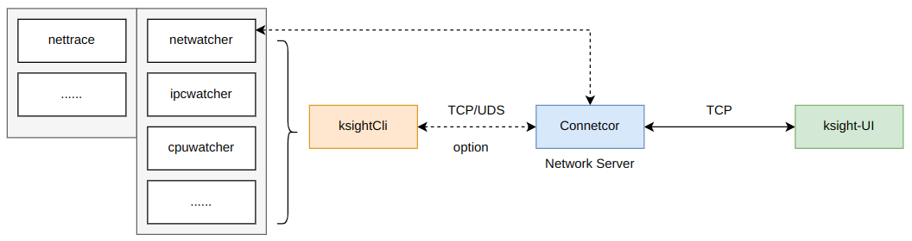

# ksight

## 1. 简介

一款用于Linux内核的可观测性定制命令行工具，覆盖CPU、内存、网络、IPC、文件、虚拟化等子系统

ksight寓意着洞见内核。

ksight family：
- [ksight](https://github.com/ziyangfu/ksight)：Linux内核可观测性定制工具。使用eBPF，命令行后端，可单独使用，正在开发中
- [ksight-lite](https://github.com/ziyangfu/ksight-lite)：针对RTOS(AUTOSAR OS?)的可观测性定制工具。命令行，后端，可单独使用，计划开发中
- [ksight-ui](https://github.com/ziyangfu/ksight-ui)： 跨平台应用软件（可能支持Windows），时间序列图表可视化，可交互。前端，与后端配套，计划开发中。

母项目直达：[lmp](https://github.com/linuxkerneltravel/lmp)

## 2. 开发语言与架构

Kernel Code: C

User Code: C++17

build tool: CMake + Shell + Python

Connector：Network server(Python/C++17， TCP、HTTPS、MQTT or DDS)

ksight-UI： based on Web， maybe in Docker



## 3. 安装
### 3.1 一键编译安装
```bash
sudo apt install clang libelf1 libelf-dev zlib1g-dev

git clone --recurse-submodules <ksight_github_address>
# eg：git clone --recurse-submodules https://github.com/ziyangfu/ksight.git
# 将安装在/usr/local/bin/ksight
sudo ./run.sh
```
### 3.2 安装ksight family

提前入坑...

```bash
mkdir ksights
cd ksights
rm -rf ./.repo/  # 如此前有同步失败，需要先删除原有.repo目录；如果没有.repo目录，可以忽略此步骤
repo init -u git@github.com:ziyangfu/ksight-repo.git -b master -m default.xml
repo sync -d --fetch-submodules
```


## 4. 使用
ksight编译安装后，会存在多个可执行文件，用户如果想单独使用某个工具，也可以直接使用。
最推荐的方式是使用ksightCli，这是一个聚合所有工具的命令行前端，具有Tab自动补全的功能。更方便使用。
例如：

```bash
ksightCli netwatcher -h

Usage: netwatcher [--help] [--version] [--all] [--err] [--extra] [--retrans] [--time] [--http] [--sport VAR] [--dport VAR] [--udp] [--net_filter] [--drop_reason] [--addr_to_func] [--icmptime] [--tcpstate] [--timeload] [--dns] [--stack] [--count VAR] [--rtt] [--rst_counters]

Watch tcp/ip in network subsystem

Optional arguments:
  -h, --help          shows help message and exits 
  -v, --version       prints version information and exits 
  -a, --all           set to trace CLOSED connection 
  -e, --err           set to trace TCP error packets 
  -x, --extra         set to trace extra conn info 
  -r, --retrans       set to trace extra retrans info 
  -t, --time          set to trace layer time of each packet 
  -i, --http          set to trace http info 
  -s, --sport         trace this source port only [nargs=0..1] [default: 0]
  -d, --dport         trace this destination port only [nargs=0..1] [default: 0]
  -u, --udp           trace the udp message 
  -n, --net_filter    trace ipv4 packget filter 
  -k, --drop_reason   trace kfree 
  -F, --addr_to_func  translation addr to func and offset 
  -I, --icmptime      set to trace layer time of icmp 
  -S, --tcpstate      set to trace tcpstate 
  -L, --timeload      analysis time load 
  -D, --dns           set to trace dns information 
  -A, --stack         set to trace of stack 
  -C, --count         specify the time to count the number of requests [nargs=0..1] [default: 0]
  -T, --rtt           set to trace rtt 
  -U, --rst_counters  set to trace rst 
```