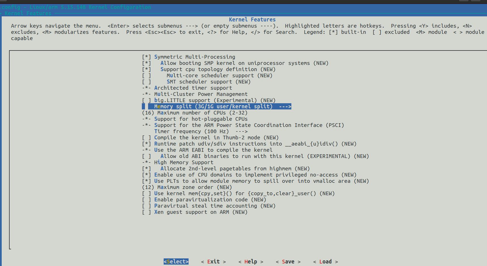
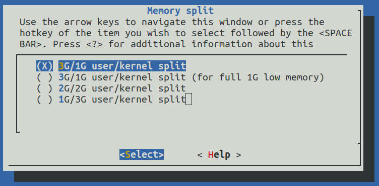
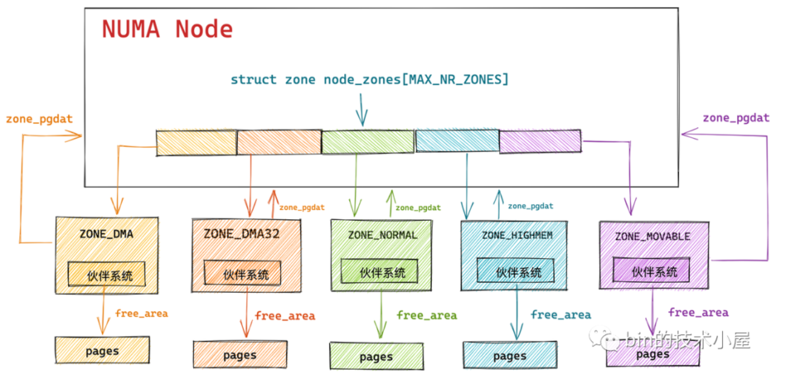
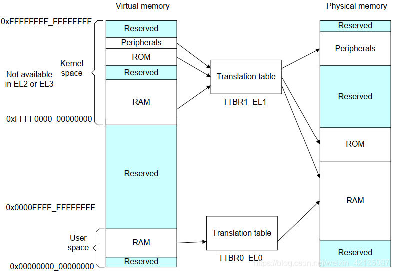
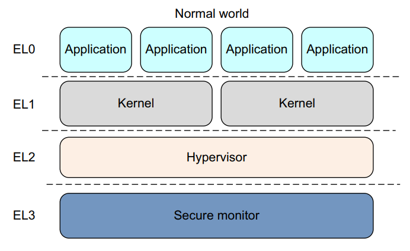
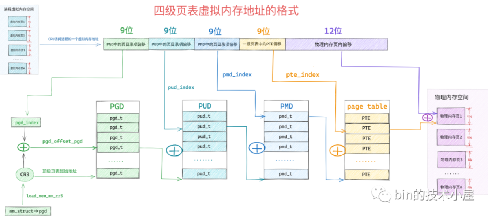
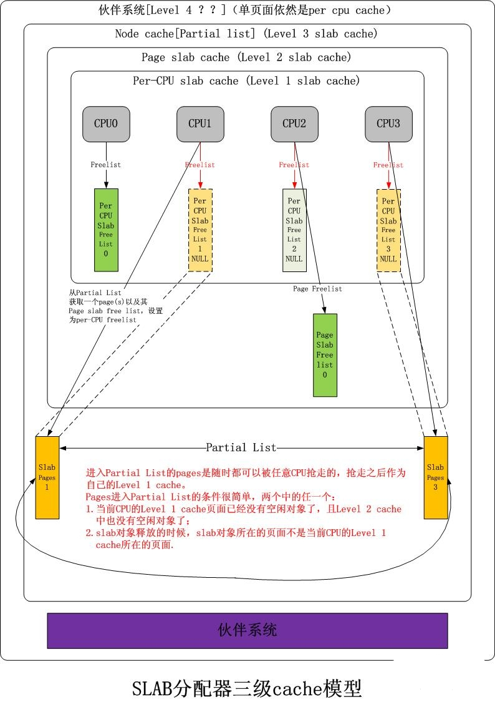
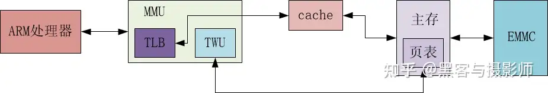

### Linux内核内存管理核心问题

##### 写在回答之前

以下这些问题，一部分是忘记哪位大师提出的核心问题，是奔跑吧Linux内核？还有一个部分是网上搜集的或者自己想的问题。

以下的回答，主要是自己看Linux5.10的源码、bin技术小屋的内存管理文章、网上搜集的知识以及AI的辅助下回答的，可能会存在很多的错误，希望可以后续更正。

##### 1. 在系统启动时，ARM Linux内核如何知道系统中有多大的内存空间？

答：内存硬件信息写在设备树文件中，bootloader读取设备树文件，并传递给内核，内核解析设备树文件，动态获取硬件系统内存信息。

```bash
+-------------------+       +-------------------+       +-------------------+
|   BootLoader      |       |   Linux Kernel    |       |   Hardware        |
+-------------------+       +-------------------+       +-------------------+
| 1. 从存储介质读取 |  --->  | 2. 解析设备树文件 |  --->  | 3. 初始化设备     |
|    设备树文件     |       |    (DTB)          |       |                   |
| 4. 传递给内核     |  --->  | 4. 动态配置       |       |                   |
+-------------------+       +-------------------+       +-------------------+
```

```bash
dmesg | grep Memory
[    0.081932] Memory: 7713716K/8134900K available (16393K kernel code, 4392K rwdata, 10880K rodata, 3372K init, 18700K bss, 420924K reserved, 0K cma-reserved)
[    0.164957] x86/mm: Memory block size: 128M
```

#####  2. 在32bit Linux内核中，用户空间和内核空间的比例通常是3:1，可以修改成2:2吗？

答：可以的，通过menuconfig。`make ARCH=arm menuconfig`

Kernel Features -> Memory Split





实际是在kconfig中，如下：

```bash
choice
	prompt "Memory split"
	depends on MMU
	default VMSPLIT_3G
	help
	  Select the desired split between kernel and user memory.

	  If you are not absolutely sure what you are doing, leave this
	  option alone!

	config VMSPLIT_3G
		bool "3G/1G user/kernel split"
	config VMSPLIT_3G_OPT
		depends on !ARM_LPAE
		bool "3G/1G user/kernel split (for full 1G low memory)"
	config VMSPLIT_2G
		bool "2G/2G user/kernel split"
	config VMSPLIT_1G
		bool "1G/3G user/kernel split"
endchoice
```
注意：64位（arm64）下，没有Memory Split，也就是无法修改。

#####  3. 物理内存页面如何添加到伙伴系统中，是一页一页添加，还是以2的几次幂来加入呢？

答： 在伙伴系统中，物理内存页面是**以2的幂次方大小的块的形式**添加到系统中的。这种设计使得内存管理更加高效，同时也便于内存块的合并和拆分操作。
在Linux内核的伙伴系统（Buddy System）中，物理内存页面的分配和回收是以2的幂次方大小的块为单位进行管理的。具体来说，内存页面的添加（回收）到伙伴系统中是以2的幂次方大小的块来加入的，而不是一页一页单独添加的。



**伙伴系统的基本原理**
伙伴系统是一种内存分配算法，主要用于管理物理内存页面。它将内存划分为大小为2的幂次方的块（如1页、2页、4页、8页……），每个块称为一个“伙伴”。当需要分配内存时，系统会根据请求的大小找到合适大小的伙伴块；当释放内存时，系统会将释放的内存块重新加入到伙伴系统中。
**内存页面的添加方式**

1. 内存块的大小：伙伴系统中的内存块大小必须是2的幂次方。例如，1页、2页、4页、8页、16页等。这是因为伙伴系统的合并和拆分操作依赖于这种幂次方的大小，能够高效地进行内存管理。
2. 内存块的回收：当一个进程释放内存时，它会将释放的内存块以2的幂次方大小的块的形式返回给伙伴系统。例如，如果一个进程释放了一个8页大小的内存块，这个8页的块会被直接添加到伙伴系统中，而不是一页一页地分别添加。
3. 合并机制：如果释放的内存块与伙伴系统中已有的相邻内存块大小相同，它们可以合并成一个更大的块。例如，如果伙伴系统中已经有一个4页的块，而释放的内存块也是一个4页的块，并且它们在物理内存中是相邻的，那么它们可以合并成一个8页的块。

如果一页一页地添加内存到伙伴系统中，会导致以下问题：

1. 效率低下：一页一页地添加会增加管理开销，因为每次添加都需要更新伙伴系统的状态。
2. 碎片化问题：一页一页地添加会增加内存碎片化的风险，导致难以找到足够大的连续内存块来满足较大内存分配请求。

通过以2的幂次方大小的块来管理内存，伙伴系统能够高效地进行内存分配和回收，同时减少内存碎片化。

##### 4. 内核的一级页表存放在什么地方？二级页表又存放在什么地方？

答：ARM32架构下，内核的一级页表基址（PGD）存在于页表基地址寄存器`TTBR1`中，记录页表项的一级页表与二级页表存在于物理内存中。
ARM32架构下，一级页表的基址存在寄存器中，其中`TTBR0`用于用户空间的地址翻译。`TTBR1`用于内核空间的地址翻译。
页表分为内核与用户进程两种。所有的内核进程地址空间的页表是共用一套的，所以`TTBR1`的值不会改变。用户进程则是每一个进程一个页表，各自独立。`TTBR0`代表了当前用户进程的页表基地址，其值会随着用户进程的切换而改变。



​																					*ARM64架构*

对于一个ARM32四核处理器来说，TTBR0有几个？

页表基地址寄存器存在与MMU中，对于SMP对称多处理多核处理器来说，每个核心均有一个MMU，因此页表基地址寄存器有4个，TTBR1指向物理内存中的同一份页表。当一个核心修改页表项时，会通过缓存一致性协议（如**MESI**）与BBM（**Break-Before-Make**）机制确保其他核心的TLB失效旧条目，避免使用过时数据。

> [一文搞懂 | ARM MMU](https://cloud.tencent.com/developer/article/1950803)
>
> [[TTBR0与TTBR1](https://www.cnblogs.com/DF11G/p/14486558.html)](https://www.cnblogs.com/DF11G/p/14486558.html)

##### 5. 用户进程的一级页表存放在什么地方？二级页表呢？

答：用户进程的一级页表与二级页表均存放在物理内存中。ARM32采用2级页表设计，ARM64采用四级页表设计（PGD-PUD-PMD-PTE）。

用户进程一级页表的地址存放在MMU中的页表基址寄存器中， ARM32为TTBR0， ARM64为TTBR0_EL0



> | **特权级** | **名称**     | **用途**                          | **典型代码示例**             |
> | :--------- | :----------- | :-------------------------------- | :--------------------------- |
> | **EL0**    | 用户态       | 运行普通应用程序                  | 用户程序、动态库             |
> | **EL1**    | 内核态       | 操作系统内核和驱动                | Linux 内核、设备驱动         |
> | **EL2**    | 虚拟机监控级 | 虚拟化管理（Hypervisor）          | KVM、Xen                     |
> | **EL3**    | 安全监控级   | 安全与非安全世界切换（TrustZone） | Secure Monitor、安全启动固件 |


#####  6. 在ARM32系统中，页表是如何映射的？在ARM64系统中，页表又是如何映射的？

答：ARM32为2级页表，PGD为一级页表。假设页大小为4KB， 则页表项需要12位来表示，PGD12位，二级页表PTE 8位。

 PGD索引 (12 bits)  PTE索引 (8 bits)  页内偏移 (12 bits) 

通过TTBR寄存器指向PGD基地址，PGD项指向PTE基地址，PTE项指向虚拟内存页表项，虚拟内存页表项通过MMU映射物理内存地址。

ARM64为4级页表，一般来说，ARM64采用48位地址划分（可修改），分别是PGD(9) PUD(9) PMD(9) PTE(9) 页表项（12， 4KB）




#####  7. 请简述Linux内核在理想情况下页面分配器(page allocator)是如何分配出连续物理页面的

答：Linux的物理内存管理与物理页面分配，是通过伙伴系统来处理的。首先，伙伴系统在系统启动时，将所有可用的物理内存页按照2的幂次方分组，形成不同大小的块。

从理论上来说。当系统收到连续物理页面的请求时，伙伴系统会根据请求的页面数量，确定所需的块的大小，然后从合适大小的空闲列表中查找是否有匹配的空闲块。如果找到的块过大，则首先先将块以减半分裂的方式，分隔成更小的块，直到有满足要求的块存在，并在其中分配物理页面给请求方。如果没有找到合适的块，会尝试合并较小的空闲块来创建一个足够大的连续区域，这一块有点像2048游戏。一旦找到合适的连续页面，会将其标记为已使用，当不在需要这些页面时，这些页面则会将其标记为空闲，并尽可能与相邻空闲块合并。

在实际中，Linux内核的实现上，理想情况可以定义为，内存充足，内存在high水位线之上，直接快速路径下分配内存。

在get_page_from_freelist函数，循环遍历zonelist，找到符合内存分配条件的物理内存区域zone，然后再在rmqueue中，进入到该物理内存区域zone对应的伙伴系统中实际分配物理内存。

#####  8. 在页面分配器中，如何从分配掩码(gfp_mask)中确定可以从哪些zone中分配内存？

答：简单的说，就是从gfp_mask中提取出zone修饰符，并且生成zone优先级列表zonelist，并且还单独存储最高优先级的内存区域zone，后续分配器会编译zone优先级类别，并从中分配内存。每个gfp_mask还有相关的降级顺序，例如HIGHMEM还可以从ZONE_HIGHMEM降级为ZONE_NORMAL。

更具体的，以Linux5.10为例：

```c
// file: mm/internal.h
struct alloc_context {
	// 运⾏进程 CPU 所在 NUMA 节点以及其所有备⽤ NUMA 节点中允许内存分配的内存区域
	// 包含了当前 NUMA 节点在内的所有备⽤ NUMA 节点的所有物理内存区域，⽤于当前 NUMA
	// 节点没有⾜够空闲内存的情况下进⾏跨 NUMA 节点分配
	struct zonelist *zonelist;
	// NUMA 节点状态掩码
	nodemask_t *nodemask;
	// 内存分配优先级最⾼的内存区域 zone
	struct zoneref *preferred_zoneref;
	// 物理内存⻚的迁移类型分为：不可迁移，可回收，可迁移类型，防⽌内存碎⽚
	int migratetype;
	// 内存分配最⾼优先级的内存区域 zone
	enum zone_type highest_zoneidx;
	// 是否允许当前 NUMA 节点中的脏⻚均衡扩散迁移⾄其他 NUMA 节点
	bool spread_dirty_pages;
};
```

在`prepare_alloc_pages(...)`中，通过`ac->highest_zoneidx = gfp_zone(gfp_mask)`获得内存分配最高优先级的内存区域zone。然后通过`ac->zonelist = node_zonelist(preferred_nid, gfp_mask)`一次性获取允许进行内存分配的内存区域。这其中还涉及到页面迁移属性的问题，绑定CPU核心问题等。最后通过`ac->preferred_zoneref = first_zones_zonelist(ac->zonelist,ac->highest_zoneidx, ac->nodemask)`获得首先分配的zone。

> highest_zoneidx 表示允许分配的最高内存区域类型（如ZONE_DMA、ZONE_NORMAL等）的索引
> 这个值在初始化不可以变，并由gfp_mask直接决定
> preferred_zoneref 指向当前NUMA节点中首选内存区域的引用（包含zone指针和zone索引信息）
> 这个值在后续是可以改变的，可能会被慢速路径调整

分配器在遍历zonelist时，会依次检查每个zone的水位线（通过`zone_watermark_fast`）、NUMA亲和性（通过`__cpuset_zone_allowed`）以及内存碎片限制（`ALLOC_NOFRAGMENT`标志）

#####  9. 页面分配器是按照什么方向来扫描zone的？

答： 从ZONE_HIGHMEM(仅32位系统) -> ZONE_NORMAL -> ZONE_DMA32 -> ZONE_DMA的方向来扫描zone的。

如果有多个NUMA节点，那么本地节点优先。

#####  10. 为用户进程分配物理内存，分配掩码应该选用GFP_KERNEL，还是GFP_HIGHUSER_MOVABLE呢？

```c
// file: include/linux/gfp.h
#define GFP_KERNEL	(__GFP_RECLAIM | __GFP_IO | __GFP_FS)
#define GFP_USER	(__GFP_RECLAIM | __GFP_IO | __GFP_FS | __GFP_HARDWALL)
#define GFP_HIGHUSER	(GFP_USER | __GFP_HIGHMEM)
#define GFP_HIGHUSER_MOVABLE	(GFP_HIGHUSER | __GFP_MOVABLE)
```

答：应该选用GFP_HIGHUSER_MOVABLE，GFP_KERNEL是为内核分配内存用的?

#####  11. slab分配器是如何分配和释放小块内存的？

slab分配器有三个变种，slab，slub，slob 统称为slab分配器，Linux5.10默认使用slub分配器。

slab主要是针对小块内存分配服务的，从伙伴系统中申请物理内存页。


##### 12. slab分配器中有一个着色的概念(cache color)，着色有什么作用？

答: Slab着色是Linux内核中一种优化技术，用于减少**缓存行伪共享（Cache Line False Sharing）**的影响。它通过在分配对象时调整对象的内存地址偏移量，确保不同CPU或线程访问的对象尽可能分布在不同的缓存行上，从而提高缓存利用率和性能。

> 缓存行伪共享问题
>
> - 缓存行（Cache Line）：现代CPU将数据以固定大小的块（通常是64字节）存储在缓存中。
> - 伪共享（False Sharing）：当多个CPU或线程访问同一缓存行中的不同数据时，即使它们互不相关，也会导致缓存一致性协议频繁同步缓存行，降低性能。
>
> 例如：
>
> - 假设有两个对象`obj1`和`obj2`位于同一缓存行中，分别被两个CPU访问。
> - 如果一个CPU修改了`obj1`，另一个CPU的缓存行会被标记为无效，即使它只关心`obj2`

通过着色，可以减少缓存行伪共享，避免多个CPU访问同一缓存行。

##### 13. slab分配其中的slab对象有没有根据Per-CPU做一些优化？

> [多核心Linux内核路径优化的不二法门之-slab与伙伴系统](https://github.com/0voice/linux_kernel_wiki/blob/main/%E6%96%87%E7%AB%A0/%E5%86%85%E5%AD%98%E7%AE%A1%E7%90%86/%E5%A4%9A%E6%A0%B8%E5%BF%83Linux%E5%86%85%E6%A0%B8%E8%B7%AF%E5%BE%84%E4%BC%98%E5%8C%96%E7%9A%84%E4%B8%8D%E4%BA%8C%E6%B3%95%E9%97%A8%E4%B9%8B-slab%E4%B8%8E%E4%BC%99%E4%BC%B4%E7%B3%BB%E7%BB%9F.md)





##### 14. slab增长并导致大量不用的空闲对象，该如何解决？


##### 15. 请问kmalloc、vmalloc和malloc之间有什么区别以及实现上的差异？

答: kmalloc与vmalloc是内核中内存分配的函数，malloc是libc中为应用软件准备的内存分配函数。kmalloc分配的内存在物理上是连续的，vmalloc分配的物理内存不一定是连续的。

| 特性             | `kmalloc`                           | `vmalloc`                                  | `malloc`                        |
| :--------------- | :---------------------------------- | :----------------------------------------- | :------------------------------ |
| **作用域**       | 内核空间                            | 内核空间                                   | 用户空间                        |
| **内存连续性**   | **物理地址连续**                    | **虚拟地址连续**（物理地址可能不连续）     | 虚拟地址连续（具体实现依赖C库） |
| **分配大小限制** | 较小（通常 ≤ 4MB）                  | 较大（理论上可分配数GB）                   | 受进程虚拟地址空间限制          |
| **适用场景**     | 需要物理连续内存的场景（如DMA操作） | 大块内存需求（如模块加载、内核临时缓冲区） | 用户态程序常规内存分配          |
| **性能**         | 高（直接操作物理内存）              | 较低（需处理页表映射）                     | 中等（依赖C库实现）             |
| **内存来源**     | Slab分配器（伙伴系统）              | 非连续物理页 + 虚拟映射                    | 堆内存（`brk`/`mmap`系统调用）  |

**实现机制差异**

1. **`kmalloc`（内核空间）**

- **底层机制**：基于 **Slab分配器**（或SLUB/SLOB变体），从伙伴系统申请物理连续的内存页。

- 关键特点

  - 分配的内存物理连续，可直接用于硬件交互（如DMA）。
  - 支持 `GFP_*` 标志（如 `GFP_KERNEL`、`GFP_ATOMIC`）控制分配行为。
  - 通过缓存预分配对象（如 `struct task_struct`）提升效率。
  
- 代码示例

  ```c
  void *ptr = kmalloc(size, GFP_KERNEL);  // 分配物理连续内存
  kfree(ptr);                             // 释放内存
  ```

2. **`vmalloc`（内核空间）**

- **底层机制**：分配多个**非连续物理页**，通过页表映射为**连续的虚拟地址**。

- 关键特点

  - 虚拟地址连续，但物理地址可能分散（需更新页表，性能较低）。
  - 适用于大块内存（如内核模块加载、临时缓冲区）。
  - 不支持直接用于DMA（需通过 `dma_alloc_coherent` 获取物理连续内存）。
  
- 代码示例

  ```c
  void *ptr = vmalloc(size);  // 分配虚拟连续内存
  vfree(ptr);                 // 释放内存
  ```

3. **`malloc`（用户空间）**

- **底层机制**：依赖C库（如glibc的 `ptmalloc`），通过 `brk` 或 `mmap` 系统调用扩展堆内存。

- 关键特点：

  - 分配虚拟地址连续的内存（物理连续性由内核保证，但用户无感知）。
  - 管理机制复杂（如空闲链表、内存池），可能产生碎片。
  - 线程安全（通过锁或线程本地缓存）。
  
- 代码示例：

  ```c
  void *ptr = malloc(size);  // 用户态内存分配
  free(ptr);                 // 释放内存
  ```

**典型场景对比**

| **场景**                        | **推荐使用** | **原因**                                                     |
| :------------------------------ | :----------- | :----------------------------------------------------------- |
| 内核驱动需要DMA缓冲区           | `kmalloc`    | 物理连续内存是DMA的必要条件                                  |
| 内核模块加载大量数据            | `vmalloc`    | 大块内存需求，物理连续性不重要                               |
| 用户程序分配动态内存            | `malloc`     | 用户态标准接口，透明处理内存管理                             |
| 高频小对象分配（如task_struct） | `kmem_cache` | 通过Slab缓存预分配对象，避免重复初始化开销（比 `kmalloc` 更高效） |

------

**性能与限制**

- `kmalloc` vs `vmalloc`：
- `kmalloc` 无页表操作，性能更高，但分配大小受限。
  - `vmalloc` 需要修改页表，且TLB刷新可能引入额外开销。

- `malloc` 的隐藏成本：
  - 可能触发缺页异常或系统调用（`brk`/`mmap`）。
  - 内存碎片问题（尤其是长时间运行的程序）。

**总结**

- **物理连续 vs 虚拟连续**：`kmalloc` 保证物理连续，`vmalloc` 和 `malloc` 仅保证虚拟连续。
- **作用域隔离**：`kmalloc`/`vmalloc` 用于内核，`malloc` 用于用户态。
- **实现复杂度**：`kmalloc` 依赖Slab优化小对象，`vmalloc` 处理非连续映射，`malloc` 依赖C库的复杂内存管理。

##### 16. 使用用户态的API函数malloc()分配内存时，会马上为其分配物理内存吗？

不会，用户调用malloc分配内存时，实际会调用brk系统调用，系统会为其分配虚拟内存，然后即返回，当该内存要使用时，内核发现虚拟内存没有映射物理内存，因此触发缺页异常，为其分配物理内存，并可能将其加入到TLB快表中


##### 17. 假设不考虑libc的因素，malloc分配100Byte，那么实际上内核是为其分配100Byte吗？

答： malloc在分配内存时，只是操作brk指针向上移动100Byte，并未实际分配内存

##### 18. 假设两个用户进程打印的malloc()分配的虚拟地址是一样的，那么在内核中这两块虚拟内存是否打架了呢？

答：不会，对于用户进程来说，每个进程有一个单独的虚拟内存， 内核通过mmu映射物理内存，因此虚拟内存地址一致，但是物理内存地址是不一致的。

##### 19. vm_normal_page()函数返回的是什么样页面的struct page数据结构？为什么内存管理代码中需要这个函数？


##### 20. 请简述get_user_page()函数的作用和实现流程？


##### 18. 请简述follow_page()函数的作用和实现流程？


##### 19. 请简述私有映射和共享映射的区别。

答： mmap有两种映射方式，从是否有文件的参与上来说，分为匿名映射与文件映射，从权限上来说，有私有映射与共享映射两种。

共享映射意味着两块虚拟内存同时指向同一块物理内存，因此可以通过共享映射，两个进程直接进行数据通信，私有映射则是仅进程内的映射，别的进程无法访问该块地址区域。

##### 20. 为什么第二次调用mmap时，Linux内核没有捕捉到地址重叠并返回失败呢？

答： mmap是在用户态虚拟内存的共享库及映射区域开辟内存，不懂......

##### 21. struct page数据结构中的_count和_mapcount有什么区别？


##### 22. 匿名页面和page cache页面有什么区别？


##### 23. struct page数据结构中有一个锁，请问trylock_page()和lock_page()有什么区别？


##### 24. 在Linux 2.4.x内核中，如何从一个page找到所有映射该页面的VMA？反响映射可以带来哪些便利？

答：struct page中存有当前page属于的那个VMA的指针，可以更快捷的向上访问？

##### 25. 阅读Linux 4.0内核RMAP机制的代码，画出父子进程之间VMA、AVC、anon_vma和page等数据结构之间的关系图。


##### 26. 在Linux 2.6.34中，RMAP机制采用了新的实现，在Linux 2.6.33和之前的版本中称为旧版本RMAP机制。那么在旧版本RMAP机制中，如果父进程有1000个子进程，每个子进程都有一个VMA，这个VMA里面有1000个匿名页面，当所有的子进程的VMA同时发生写复制时会是什么情况呢？


##### 27. 当page加入lru链表中，被其他线程释放了这个page，那么lru链表如何知道这个page已经被释放了。

答： LRU链表指的是最近最少使用的链表

##### 28. kswapd内核线程何时会被唤醒？

答：kswapd内核线程是用于当内存比较慢时，将闲置内存置换的交换空间上。 kswapd每个核心一个。

##### 29. LRU链表如何知道page的活动频繁程度？
##### 30. kswapd按照什么原则来换出页面？
##### 31. kswapd按照什么方向来扫描zone？
##### 32. kswapd以什么标准来退出扫描LRU？
##### 33. 手持设备例如Android系统，没有swap分区或者swap文件，kswapd会扫描匿名页面LRU吗？
##### 34. swappiness的含义是什么？kswapd如何计算匿名页面和page cache之间的扫描比重？

答： swappiness表示系统内存置换到交换空间的积极度，数值越大，内存置换到交换空间越积极。

`cat /proc/sys/vm/swappiness`或者`sysctl vm.swappiness`可以查看当前swappiness值，ubuntu上设置为60，嵌入式平台处于速度方面的考虑，建议禁止交换空间。

##### 35. 当系统充斥着大量只访问一次的文件访问(use-one streaming IO)时，kswapd如何来规避这种风暴？
##### 36. 在回收page cache时，对于dirty的page cache，kswapd会马上回写吗？
##### 37. 内核有哪些页面会被kswapd写回交换分区？
##### 38. ARM32 Linux如何模拟这个Linux版本的L_PTE_YOUNG比特位呢？
##### 39. 如何理解Refault Distance算法？
##### 40. 请简述匿名页面的生命周期。在什么情况下会产生匿名页面？在什么条件下会释放匿名页面？
##### 41. KSM是基于什么原理来合并页面的？
##### 42. 在KSM机制里，合并过程中把page设置成写保护的函数write_protect_page()有这样一个判断：。这个判断的依据是什么？
##### 43. 如果多个VMA的虚拟页面同时映射了同一个匿名页面，那么此时page->index应该等于多少？
##### 44. 为什么Dirty COW小程序可以修改一个只读文件的内容？
##### 45. 在Dirty COW内存漏洞中，如果Diryt COW程序没有madviseThread线程，即只有procselfmemThread线程，能否修改foo文件的内容呢？
##### 46. 假设在内核空间获取了某个文件对应的page cache页面的struct page数据结构，而对应的VMA属性是只读，那么内核空间是否可以成功修改该文件呢？

答：【???】可以，内核具有超级权限

##### 47. 如果用户进程使用只读属性(PROT_READ)来mmap映射一个文件到用户空间，然后使用memcpy来写这段内存空间，会是什么样的情况？
##### 48. 请画出内存管理中常用的数据结构的关系图，如mm_struct、vma、vaddr、page、pfn、pte、zone、paddr和pg_data等，并思考如下转换关系
##### 49. 请画出在最糟糕的情况下分配若干个连续物理页面的流程图。
##### 50. 在Android中新添加了LMK(Low Memory Killer)，请描述LMK和OOM Killer之间的关系。
##### 51. 请描述一致性DMA映射dma_alloc_coherent()函数在AEM中是如何管理cache一致性的？
##### 52. 请描述流式DMA映射dma_map_single()函数在ARM中是如何管理cache一致性的？
##### 53. 为什么在Linux 4.8内核中要把基于zone的LRU链表机制迁移到基于Node呢？


---

> 其他的有价值问题

##### 现代CPU的每个core都有自己的MMU吗？

答：每个核心都有自己的MMU。



在[SMP](https://zhida.zhihu.com/search?content_id=544295883&content_type=Answer&match_order=1&q=SMP&zhida_source=entity)（Symmetric Multi Process，对称多处理器）系统中，每个处理器内置了MMU模块，MMU模块包含了[TLB](https://zhida.zhihu.com/search?content_id=544295883&content_type=Answer&match_order=1&q=TLB&zhida_source=entity)和[TWU](https://zhida.zhihu.com/search?content_id=544295883&content_type=Answer&match_order=1&q=TWU&zhida_source=entity)两个子模块。TLB是一个高速缓存，用于缓存虚拟地址到物理地址的转换结果。页表的查询过程是由TWU硬件自动完成的，但是页表的维护是需要操作系统实现的，页表存放在主存中。

> [现代CPU的每个core都有自己的MMU吗](https://www.zhihu.com/question/38064979/answer/2828157858)


---

> 以下摘抄自：[CPU--进阶知识](https://blog.csdn.net/yaoming168/article/details/131256286)

CPU实战知识
1．ARM64处理器中有两个页表基地址寄存器TTBR0和TTBR1，处理器如何使用它们？
2．请简述ARM64处理器的4级页表的映射过程，假设页面粒度为4KB，地址宽度为48位。
3．在L0～L2页表项描述符中，如何判断一个页表项是块类型还是页表类型？
4．在ARM64 Linux内核中，用户空间和内核空间是如何划分的？
5．在ARM64 Linux内核中，PAGE_OFFSET表示什么意思？
6．KIMAGE_VADDR表示什么意思？
7．TEXT_OFFSET表示什么意思？
8．内核映像文件包含哪些段？这些段的作用是什么？在Sysmtem.map文件中它们分别使用哪些符号来表示段的开始和结束？
9．请画出ARM64 Linux内核的内存布局。
10．pasymbol()宏和\_pa()宏有什么区别？
11．在物理内存还没有线性映射到内核空间时，内核映像文件映射到什么地方？
12．在ARM Linux内核中，kimage_voffset代表什么意思呢？
13．在ARMv8架构中，高速缓存管理的PoC和PoU有什么区别？
14．在ARMv8架构中，ASID是什么意思？有什么作用？
15．在ARMv8架构中支持哪几种内存属性？它们都有哪些特点？
16．在ARMv8架构中，高速缓存共享属性有内部共享（inner shareable）和外部共享（outer shareable），它们有什么区别？
17．在ARMv8架构中，支持哪几条内存屏障指令？它们都有什么区别？
18．加载-获取屏障原语与存储-释放屏障原语有什么区别？分别有什么作用？
19．什么是一个段的加载地址和运行地址？
20．从U-boot跳转到内核时，为什么指令高速缓存可以打开而数据高速缓存必须关闭？
21．在Linux内核启动汇编代码中，为什么要建立恒等映射？
22．在ARMv8架构中，在L0～L2页表项中包含了指向下一级页表的基地址，那么这个下一级页表基地址是物理地址还是虚拟地址？
23．MMU可以遍历页表，Linux内核也提供了软件遍历页表的函数，如walk_pgd()、create_pgd_mapping()、follow_page()等。从软件的视角，Linux内核的pgd_t、pud_t、pmd_t以及pte_t数据结构中并没有存储一个指向下一级页表的指针（即从CPU角度来看，CPU访问这些数据结构时是以虚拟地址来访问的），它们是如何遍历的呢？pgd_t、pud_t、pmd_t以及pte_t数据结构是u64类型的变量。


1．ARM64处理器中有两个页表基地址寄存器TTBR0和TTBR1，处理器如何使用它们？
答：


TTBR0寄存器：TTBR0寄存器用于存储用户空间的页表基地址。当ARM64处理器执行用户空间的代码时，它会使用TTBR0寄存器中存储的页表基地址进行虚拟地址到物理地址的转换。

TTBR1寄存器：TTBR1寄存器用于存储内核空间的页表基地址。当ARM64处理器执行内核空间的代码时，它会使用TTBR1寄存器中存储的页表基地址进行虚拟地址到物理地址的转换。

通过使用两个不同的页表基地址寄存器，ARM64处理器能够实现用户空间和内核空间之间的地址隔离。这样，用户空间和内核空间可以拥有各自独立的页表，从而实现虚拟地址的隔离和保护。

需要注意的是，具体的页表结构和页表项的格式可能会因操作系统和配置而有所不同。ARM64处理器提供了灵活的页表机制，可以根据需求进行配置和扩展。

2．请简述ARM64处理器的4级页表的映射过程，假设页面粒度为4KB，地址宽度为48位。
答：
    ARM64处理器的4级页表是用于虚拟地址到物理地址的映射的一种机制。假设页面粒度为4KB，地址宽度为48位，下面是4级页表的映射过程：

虚拟地址划分：根据48位的虚拟地址，将其划分为四个部分：

16位的L0索引：用于在第一级页表中选择一个L1页表。
16位的L1索引：用于在第二级页表中选择一个L2页表。
16位的L2索引：用于在第三级页表中选择一个L3页表。
12位的L3偏移：用于在第四级页表中选择一个物理页帧。
第一级页表（L0）：根据L0索引，在第一级页表中找到对应的L1页表的基地址。

第二级页表（L1）：根据L1索引，在第二级页表中找到对应的L2页表的基地址。

第三级页表（L2）：根据L2索引，在第三级页表中找到对应的L3页表的基地址。

第四级页表（L3）：根据L3偏移，在第四级页表中找到对应的物理页帧的基地址。

物理地址计算：将找到的物理页帧的基地址与L3偏移相加，得到最终的物理地址。

通过这个过程，ARM64处理器能够将48位的虚拟地址映射到对应的物理地址。这种4级页表的映射机制能够提供灵活的地址空间管理，支持大内存容量和多级映射的需求。

3．在L0～L2页表项描述符中，如何判断一个页表项是块类型还是页表类型？
答：
    在L0～L2页表项描述符中，可以通过判断其中的一个特定标志位来确定一个页表项是块类型还是页表类型。这个特定标志位称为"Table"位。

如果"Table"位为0，表示该页表项是块类型。块类型的页表项用于描述一个大的连续物理内存块的映射，例如用于描述1GB或2MB的大页。

如果"Table"位为1，表示该页表项是页表类型。页表类型的页表项用于描述下一级页表的地址，从而实现多级页表的层级结构。

通过检查"Table"位的值，可以确定一个页表项是块类型还是页表类型，进而确定如何解释该页表项的其他字段。这样，ARM64处理器能够根据不同类型的页表项来实现不同层级的地址映射，以满足不同的内存管理需求。

4．在ARM64 Linux内核中，用户空间和内核空间是如何划分的？
答：
    在ARM64架构的Linux内核中，用户空间和内核空间是通过虚拟地址空间的划分来实现的。

ARM64架构使用了48位的虚拟地址空间，将整个地址空间划分为两个部分：用户空间和内核空间。

用户空间（User Space）：用户空间是用于执行用户应用程序的区域。它包含了用户进程的代码、数据和堆栈等。用户空间的虚拟地址范围通常是从0x0000000000000000到0x00007FFFFFFFFFFF。

内核空间（Kernel Space）：内核空间是用于运行操作系统内核的区域。它包含了内核的代码、数据结构、设备驱动程序等。内核空间的虚拟地址范围通常是从0xFFFF800000000000到0xFFFFFFFFFFFFFFFF。

用户空间和内核空间之间通过一组页表进行映射和隔离。通过页表的设置，用户空间和内核空间的虚拟地址可以映射到不同的物理地址，实现了对用户空间和内核空间的隔离和保护。

用户空间和内核空间的划分是为了保护内核的安全性和稳定性。用户空间的应用程序只能访问用户空间的资源，而不能直接访问内核空间的资源。通过系统调用和中断等机制，用户空间可以与内核空间进行通信和交互，从而实现对系统资源的访问和管理。

5．在ARM64 Linux内核中，PAGE_OFFSET表示什么意思？
答：
    在ARM64 Linux内核中，PAGE_OFFSET是一个宏定义，用于表示内核空间的偏移量。

在ARM64架构中，内核空间的起始地址是固定的，通常是0xFFFF800000000000。而用户空间的起始地址是可变的，取决于具体的进程。

PAGE_OFFSET的值就是内核空间起始地址的低32位部分，即0x00000000FFFFFFFF。通过将PAGE_OFFSET与虚拟地址的高32位相或，可以将虚拟地址转换为对应的物理地址。

在内核中，PAGE_OFFSET常常用于进行虚拟地址和物理地址的转换，以及进行内核空间和用户空间的判断和操作。

6．KIMAGE_VADDR表示什么意思？
答：
    KIMAGE_VADDR是一个在ARM64 Linux内核中使用的宏定义，用于表示内核镜像在虚拟地址空间中的起始地址。

在ARM64架构中，内核镜像通常被加载到虚拟地址空间的固定位置。KIMAGE_VADDR的值就是内核镜像在虚拟地址空间中的起始地址，通常是一个固定的地址。

通过使用KIMAGE_VADDR宏定义，可以方便地在内核中引用内核镜像的起始地址，进行一些与内核镜像相关的操作，如符号查找、地址计算等。

7．TEXT_OFFSET表示什么意思？
答：
    TEXT_OFFSET是一个在操作系统中使用的术语，用于表示程序代码在内存中的偏移量。

在计算机系统中，程序代码通常存储在内存中的某个特定位置。TEXT_OFFSET就是指代码段在内存中相对于整个进程空间起始地址的偏移量。它表示了代码段相对于进程内存空间起始地址的位置。

通过使用TEXT_OFFSET，可以方便地在程序中引用代码段的地址，进行一些与代码段相关的操作，如跳转、函数调用等。它在程序的执行过程中起到了定位代码的作用。

8．内核映像文件包含哪些段？这些段的作用是什么？在Sysmtem.map文件中它们分别使用哪些符号来表示段的开始和结束？
答：
    内核映像文件通常包含以下几个段：

.text段：这是代码段，包含了内核的执行代码。它是内核的核心部分，包括系统调用、中断处理程序、驱动程序等。

.data段：这是数据段，包含了内核的全局变量和静态变量。它存储了内核运行时需要的数据。

.rodata段：这是只读数据段，包含了内核中的只读数据，如字符串常量、只读的全局变量等。

.bss段：这是未初始化数据段，包含了内核中的全局未初始化变量。在内核加载时，这些变量会被初始化为0或空值。

这些段在System.map文件中使用以下符号来表示它们的开始和结束：

_text表示.text段的开始地址。
_etext表示.text段的结束地址。
_data表示.data段的开始地址。
_edata表示.data段的结束地址。
__start_rodata表示.rodata段的开始地址。
__end_rodata表示.rodata段的结束地址。
__bss_start表示.bss段的开始地址。
__bss_stop表示.bss段的结束地址。
System.map文件是一个符号表文件，用于映射内核中的符号（如变量、函数等）与其在内存中的地址之间的关系。通过查看System.map文件，可以了解到这些段在内存中的起始和结束地址，以及其他符号的信息。

9．请画出ARM64 Linux内核的内存布局。
答：


10．__pasymbol()宏和_pa()宏有什么区别？
答：
    __pasymbol()宏和_pa()宏在功能上是相似的，都用于获取一个符号（symbol）的物理地址。它们的主要区别在于使用的上下文和调用方式。

__pasymbol()宏是用于内核代码中的，用于获取某个符号的物理地址。它的定义如下：

#define __pasymbol(sym) ((unsigned long)(__pa_symbol(sym)))
1
其中，__pa_symbol(sym)是一个内部宏，用于获取符号sym的物理地址。

_pa()宏则是用于内核以外的代码中的，用于获取某个内核符号的物理地址。它的定义如下：

#define _pa(x) ((unsigned long)(x) - PAGE_OFFSET)
1
其中，x是一个内核符号（如变量、函数等），PAGE_OFFSET是一个宏定义，表示内核的偏移地址。

总的来说，__pasymbol()宏和_pa()宏都是用于获取符号的物理地址，但使用的上下文和调用方式有所不同。__pasymbol()宏主要用于内核代码中，而_pa()宏主要用于内核以外的代码中。

11．在物理内存还没有线性映射到内核空间时，内核映像文件映射到什么地方？
答：
    在物理内存还没有线性映射到内核空间之前，内核映像文件会被加载到一个临时的虚拟地址空间中。这个虚拟地址空间被称为"临时内核空间"或"早期映射空间"。

在Linux内核启动的早期阶段，内核会将自身的映像文件加载到这个临时内核空间中。这个临时内核空间的大小通常是一个固定的值，例如在x86架构中，通常是从虚拟地址0xC0000000开始的一段连续地址空间。

一旦内核映像文件被加载到临时内核空间中，内核就可以执行自己的代码，并通过临时内核空间中的虚拟地址访问内核的数据结构和函数。随后，在内核初始化的过程中，物理内存会被线性映射到内核空间中，临时内核空间会被废弃，内核映像文件会被重新映射到新的线性地址空间中。

12．在ARM Linux内核中，kimage_voffset代表什么意思呢？
答：
    在ARM Linux内核中，kimage_voffset代表内核映像（Kernel Image）的垂直偏移。它是一个变量，用于表示内核映像在物理内存中的偏移量。

在ARM架构中，内核映像在物理内存中的位置是由引导加载程序（Bootloader）决定的。引导加载程序负责将内核映像从存储设备加载到内存中，并告诉内核映像的加载地址。

kimage_voffset的值是在内核启动过程中由引导加载程序传递给内核的。内核使用这个值来计算内核映像在物理内存中的实际地址。通过将加载地址和kimage_voffset相加，内核可以得到内核映像在物理内存中的正确位置。

总结起来，kimage_voffset是ARM Linux内核中用于表示内核映像在物理内存中的垂直偏移的变量。它的值由引导加载程序传递给内核，用于计算内核映像的实际加载地址。

13．在ARMv8架构中，高速缓存管理的PoC和PoU有什么区别？
答：
    在ARMv8架构中，高速缓存管理的PoC（Point of Coherency）和PoU（Point of Unification）是两个不同的概念，用于确保数据的一致性和同步。

PoC（Point of Coherency）：PoC是指在数据从处理器核心写入到内存之前，需要确保高速缓存中的数据与内存中的数据保持一致。它主要用于确保处理器核心之间的数据共享的一致性。在使用PoC时，写操作会在到达内存之前刷新高速缓存，以确保其他处理器核心访问相同内存地址时能够获取到最新的数据。

PoU（Point of Unification）：PoU是指在数据从内存加载到处理器核心之前，需要确保高速缓存中的数据与内存中的数据保持一致。它主要用于确保处理器核心与内存之间的数据一致性。在使用PoU时，读操作会在从内存加载数据到处理器核心之前，无效化高速缓存中的数据，以确保从内存加载最新的数据。

总的来说，PoC和PoU都是用于确保数据的一致性和同步的机制。PoC用于处理器核心之间的数据共享的一致性，而PoU用于处理器核心与内存之间的数据一致性。它们在高速缓存管理中起到了不同的作用。

14．在ARMv8架构中，ASID是什么意思？有什么作用？
答：
    在ARMv8架构中，ASID（Address Space Identifier）是一种用于标识进程地址空间的机制。每个进程都被分配一个唯一的ASID，用于区分不同的地址空间。

ASID的作用是提高地址转换的效率。在传统的ARM架构中，每次进行地址转换时，需要访问页表以获取正确的映射关系。而在ARMv8架构中，通过使用ASID，可以将最近使用的页表项缓存在TLB（Translation Lookaside Buffer）中，以加快地址转换的速度。当进程切换时，只需要切换ASID，无需刷新整个TLB。

ASID的范围是从0到2^16-1， 因此ARMv8架构最多支持2^16 个唯一的地址空间。这使得ARMv8处理器能够高效地支持多任务操作系统，同时保持较低的地址转换开销。

总结来说，ASID在ARMv8架构中用于标识不同的进程地址空间，并提供了一种高效的地址转换机制，以提高系统的性能和效率。

15．在ARMv8架构中支持哪几种内存属性？它们都有哪些特点？
答：
    在ARMv8架构中，支持以下几种内存属性：

Normal内存属性：Normal内存属性用于大多数通用内存区域，包括代码、数据和堆栈等。Normal内存属性可以进一步细分为以下几种特点：

Normal memory non-cacheable（nGnRnE）：这种属性表示内存区域不被缓存，并且不具备乱序执行和早期写入策略。适用于设备寄存器、DMA缓冲区等。
Normal memory non-cacheable, shareable（nGnRnE）：与上述属性类似，但可共享给其他处理器。
Normal memory write-back cacheable（nGnRE）：这种属性表示内存区域被缓存，并且支持写回策略。适用于大多数通用内存区域。
Normal memory write-back cacheable, shareable（nGnRE）：与上述属性类似，但可共享给其他处理器。
Device内存属性：Device内存属性用于设备寄存器、I/O缓冲区等外设相关的内存区域。Device内存属性的特点是不被缓存，并且不进行乱序执行和早期写入策略。

Strongly-ordered内存属性：Strongly-ordered内存属性表示对内存访问的顺序要求非常严格，不进行缓存、乱序执行和早期写入。适用于对内存访问顺序要求非常严格的特殊情况。

Shareable内存属性：Shareable内存属性指示内存区域可与其他处理器共享，并且对缓存一致性有特殊要求。

这些内存属性在ARMv8架构中用于描述内存区域的特性和访问行为，以便处理器和系统在访问内存时能够正确地进行操作和优化。不同的内存属性适用于不同的内存区域和使用场景，确保系统的性能、安全性和一致性。

16．在ARMv8架构中，高速缓存共享属性有内部共享（inner shareable）和外部共享（outer shareable），它们有什么区别？
答：
    在ARMv8架构中，高速缓存共享属性有内部共享（inner shareable）和外部共享（outer shareable），它们的区别如下：

内部共享（inner shareable）：内部共享表示高速缓存中的数据可以在同一个处理器核心的不同级别的缓存之间共享。这意味着在同一个处理器核心中，不同级别的缓存（如L1缓存、L2缓存等）可以共享缓存行中的数据。内部共享适用于多级缓存之间的数据共享，可以提高缓存的利用率和性能。

外部共享（outer shareable）：外部共享表示高速缓存中的数据可以在不同处理器核心之间共享。这意味着在多个处理器核心之间，缓存中的数据可以进行共享。外部共享适用于多个处理器核心之间的数据共享，可以实现多核处理器的协同工作和数据一致性。

在ARMv8架构中，可以通过在内存区域的描述符中设置相应的共享属性来指定内部共享或外部共享。这样，处理器和系统可以根据缓存共享属性来进行高速缓存的管理和数据共享，以提高系统性能和一致性。

17．在ARMv8架构中，支持哪几条内存屏障指令？它们都有什么区别？
答：
    在ARMv8架构中，支持以下几条内存屏障指令：

DMB（Data Memory Barrier）：该指令用于确保数据操作的顺序性和一致性。它会阻止在屏障之后的数据访问指令重排序，并确保在屏障之前的数据访问指令完成后再执行屏障之后的指令。

DSB（Data Synchronization Barrier）：该指令用于确保数据操作的顺序性和一致性，并且还会等待所有先前的数据访问指令完成。它会阻止在屏障之后的数据访问指令重排序，并等待在屏障之前的数据访问指令完成后再执行屏障之后的指令。

ISB（Instruction Synchronization Barrier）：该指令用于确保指令的顺序性和一致性。它会刷新处理器的指令流水线，并确保在屏障之前的指令执行完成后再执行屏障之后的指令。

这些内存屏障指令的区别如下：

DMB主要用于数据操作的顺序性和一致性，防止数据访问指令重排序，并确保先前的数据访问指令完成后再执行后续指令。
DSB除了具有DMB的功能外，还会等待所有先前的数据访问指令完成，即它会确保在屏障之前的数据访问指令完成后再执行后续指令。
ISB主要用于指令的顺序性和一致性，它会刷新处理器的指令流水线，并确保在屏障之前的指令执行完成后再执行后续指令。
这些内存屏障指令在多核处理器系统中尤为重要，可以确保数据和指令的一致性，并提供正确的同步机制，以避免数据访问和指令执行的异常情况。

18．加载-获取屏障原语与存储-释放屏障原语有什么区别？分别有什么作用？
答：
    加载-获取屏障原语（Load-Acquire Barrier）和存储-释放屏障原语（Store-Release Barrier）是内存屏障的两种类型，它们在多线程编程中起着不同的作用。

加载-获取屏障原语（Load-Acquire Barrier）：

作用：加载-获取屏障用于确保在屏障之前的加载操作完成后，后续的读取操作不会读取到过期的数据。
功能：加载-获取屏障会阻止在屏障之后的读取指令重排序，并确保在屏障之前的加载指令完成后再执行后续指令。
存储-释放屏障原语（Store-Release Barrier）：

作用：存储-释放屏障用于确保在屏障之前的存储操作完成后，后续的写入操作对其他线程可见。
功能：存储-释放屏障会阻止在屏障之前的写入指令重排序，并确保在屏障之前的存储指令完成后再执行后续指令。
这两种屏障原语的区别在于它们对读取和写入操作的影响。加载-获取屏障主要关注读取操作，确保读取操作不会读取到过期的数据。而存储-释放屏障主要关注写入操作，确保写入操作对其他线程可见。

在多线程编程中，加载-获取屏障和存储-释放屏障的正确使用可以确保内存操作的顺序性和一致性，避免数据竞争和并发访问的问题。这些屏障原语在同步和通信的场景中非常有用，例如线程间的共享变量同步、锁的获取和释放等。

19．什么是一个段的加载地址和运行地址？
答：
    段的加载地址（Load Address）和运行地址（Runtime Address）是与内存中的段（Segment）相关的概念。

在计算机系统中，段是内存分配的基本单位，用于存储程序的指令、数据和堆栈等信息。每个段都有一个加载地址和一个运行地址。

加载地址是指段在物理内存中的起始地址，也称为物理地址。当程序被加载到内存中时，段会被放置在指定的物理内存地址上。

运行地址是指段在程序执行过程中在虚拟内存中的地址，也称为虚拟地址。在程序执行时，操作系统会将物理内存中的段映射到进程的虚拟地址空间中，并为每个进程创建独立的地址空间。

加载地址和运行地址的区别在于它们所描述的地址空间的不同。加载地址是指段在物理内存中的位置，而运行地址是指段在虚拟内存中的位置。

加载地址和运行地址的概念在内存管理和程序执行过程中非常重要。它们的使用可以实现地址空间的隔离和保护，确保程序的正确加载和执行。

20．从U-boot跳转到内核时，为什么指令高速缓存可以打开而数据高速缓存必须关闭？
答：
    从U-boot跳转到内核时，指令高速缓存（Instruction Cache）可以打开而数据高速缓存（Data Cache）必须关闭，是因为在这个阶段的执行环境和需求不同。

U-boot是一个引导加载程序，它在系统启动时负责初始化硬件、加载内核镜像等操作。在这个阶段，U-boot需要频繁地读取指令来执行引导过程，因此打开指令高速缓存可以提高指令的访问速度和执行效率。

而数据高速缓存则需要在内核初始化之后才能安全地启用。内核初始化时，会进行一系列复杂的操作，包括内存管理、设备初始化、中断处理等。在这个阶段，数据高速缓存可能会导致缓存一致性的问题，因为内核对内存的读写操作是频繁且复杂的，可能会出现数据不一致的情况。因此，为了保证正确性，U-boot在跳转到内核之前需要关闭数据高速缓存。

一旦内核初始化完成，数据高速缓存就可以安全地启用了。在内核中，数据高速缓存的打开可以提高内存访问的速度和效率，从而提升系统的整体性能。

21．在Linux内核启动汇编代码中，为什么要建立恒等映射？
答：
    在Linux内核启动汇编代码中，建立恒等映射的目的是为了确保在启动过程中可以正确访问物理地址空间。

恒等映射是指将物理地址与相同的虚拟地址进行一一映射的过程。在Linux内核启动的早期阶段，尚未建立页表和虚拟内存管理，因此需要通过恒等映射来直接访问物理地址。

建立恒等映射的主要原因有两个：

早期启动：在启动过程中，内核需要进行一些基本的初始化操作，如设置页表、建立内存映射等。为了执行这些操作，需要通过恒等映射来访问物理地址空间。

早期打印：在启动过程中，内核需要输出一些调试信息和错误信息，以便进行故障排除。为了能够将这些信息输出到控制台或串口，需要通过恒等映射来访问物理地址空间中的相关设备。

通过建立恒等映射，内核可以在启动过程中正确地访问物理地址空间，执行必要的初始化和输出操作。一旦建立了页表和虚拟内存管理，就可以使用更高级的内存管理机制来管理和访问内存。

22．在ARMv8架构中，在L0～L2页表项中包含了指向下一级页表的基地址，那么这个下一级页表基地址是物理地址还是虚拟地址？
答：
    在ARMv8架构中，L0～L2页表项中包含的下一级页表的基地址是物理地址。这是因为ARMv8架构使用了虚拟地址转换机制，通过页表将虚拟地址映射到物理地址。在这个过程中，每个页表项都包含了下一级页表的物理地址，用于构建页表的层级结构。通过这种方式，ARMv8架构能够实现虚拟地址到物理地址的转换和映射。

23．MMU可以遍历页表，Linux内核也提供了软件遍历页表的函数，如walk_pgd()、create_pgd_mapping()、follow_page()等。从软件的视角，Linux内核的pgd_t、pud_t、pmd_t以及pte_t数据结构中并没有存储一个指向下一级页表的指针（即从CPU角度来看，CPU访问这些数据结构时是以虚拟地址来访问的），它们是如何遍历的呢？pgd_t、pud_t、pmd_t以及pte_t数据结构是u64类型的变量。
答：
    在Linux内核中，MMU（内存管理单元）可以遍历页表，而Linux内核提供了一些函数来实现软件遍历页表的功能，如walk_pgd()、create_pgd_mapping()、follow_page()等。

从软件的视角来看，Linux内核中的pgd_t、pud_t、pmd_t和pte_t数据结构并没有直接存储指向下一级页表的指针。这是因为在ARMv8架构中，页表的层级结构是通过页表项中存储的物理地址来建立的，而不是通过指针。

在ARMv8架构中，pgd_t、pud_t、pmd_t和pte_t数据结构是u64类型的变量。它们的值实际上是一个物理地址，用于指向下一级页表或页表项。当CPU访问这些数据结构时，实际上是通过虚拟地址来访问的，而MMU会根据页表的映射关系将虚拟地址转换为对应的物理地址。

因此，通过软件遍历页表时，Linux内核会根据页表项中存储的物理地址来逐级遍历页表，而不是通过指针。这样，Linux内核能够根据页表项中的物理地址来获取下一级页表的位置，并进行遍历和访问。

