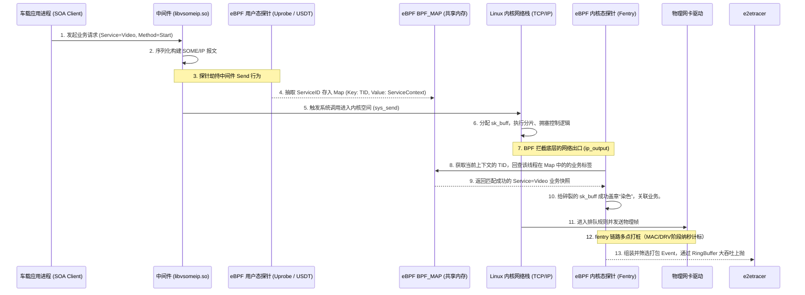

# 智能网联汽车 SOA 垂直全链路追踪系统 (E2ETracer) 技术评审与架构需求白皮书

## 1. 行业宏观背景与项目立项诉求

### 1.1 汽车电子电气架构（EEA）的演进与通讯变革
在汽车电子电气架构（EEA）从传统的分布式（Distributed）向中央计算+区域控制器（Centralized + Zonal）演进的历史浪潮中，车内通信系统发生了翻天覆地的变化。传统的基于信号（Signal-Based）的通信系统（如 CAN、LIN、FlexRay）逐渐暴露出带宽低、扩展性差、与高阶自动驾驶需求不匹配等严重问题。为了满足自动驾驶域庞大的传感器数据（如超声波、毫米波、激光雷达点云及 8M/12M 摄像头的高清视频流）以及复杂的跨域协调，基于以太网的服务导向架构（Service-Oriented Architecture, SOA）成为了工业界的绝对共识。

目前，绝大多数车内核心组件通信均构建于 AUTOSAR 所倡导的 SOME/IP（Scalable service-Oriented MiddlewarE over IP）或基于发布/订阅（Pub/Sub）模型的 DDS（Data Distribution Service）中间件之上。这种 SOA 架构极大地提升了软件的模块化水平和代码复用率。

### 1.2 当代车载可观测性面临的绝境
尽管 SOA 中间件带来了高度灵活性，但其在 Linux 操作系统上的落地却为系统诊断与异常排查带来了毁灭性的打击：
1. **“业务与底层”的巨大认知割裂**：当智能驾驶系统出现“刹车指令下发延迟”，或“摄像头点云传输卡顿”时，网络工程师如果使用 `tcpdump` 或 `Wireshark` 等传统工具，只能看到网卡上密集发送的带有源目的 IP 地址和 UDP/TCP 端口的二进制网络包。他们完全无法得知“这个随机端口（如 43512）”到底对应哪个具体的 SOA 服务（Service ID）和方法（Method ID）。
2. **“黑盒延迟”无法有效剥离**：在整个数据包的生命周期（Lifecycle）中，它经历了：`[应用层序列化] -> [Socket 缓冲区] -> [Linux 传输层及拥塞控制] -> [Linux 网络层排队] -> [Linux 链路层 QDisc (排队规则) 调度] -> [物理网卡驱动 Ring Tx 发送]`。传统的网络监控只能计算包进出网卡的时间，一旦发现耗时过长，我们根本无从分辨是应用层进程阻塞，还是 Linux 内核 TCP 栈发送窗口满了阻挡了发包，亦或是网卡驱动被打挂了。
3. **资源枯竭与安全隐患**：在算力极度受限的域控制器（尤其是包含安全模块的 MCU 或 CPU 资源锁死的智驾域），运行传统诊断工具消耗的 CPU 和内存资源会严重破坏正常业务的实时交互时序（Timing Constraints），容易引发不可预测的连锁反应崩溃。

### 1.3 `e2etracer` 的设计使命
针对上述不可调和的矛盾，本工具 `e2etracer`（End-to-End Tracer）立项。我们的首要准则是**零代码侵入（Zero-Instrumentation）**与**极低运行开销（Low-Overhead）**。
旨在打造一款全链路垂直诊断兵器，它不仅能在底层捕获极其精确（纳秒级）的各阶段时间戳，更能**向上“刺破”协议栈黑盒，直接关联具体的业务（SOA Service）**，将网络底层的性能数据带上清晰的工业级业务语义，供高级排障专家进行一键级根因分析。

---

## 2. 核心技术路线研判：为什么我们推翻了常规思路？

在确定当前架构之前，设计团队经历了深度的可行性验证，并且推翻了大量看似合理实则在 Linux 网络栈中寸步难行的传统构想。理解“为什么不怎么做”，是理解 `e2etracer` 现有架构合理性的关键所在。

### 2.1 弃用路线一：纯应用协议层旁路抓包（libpcap / AF_PACKET）
最直观的想法是通过 libpcap 在网卡层拷贝全量流量，将其上抛到用户态，在用户态程序中实现一套完整的 SOME/IP 解码器去提取 Service ID，然后计算包的大小。
**被否决原因**：
1. **性能崩塌**：这是一种“事后诸葛亮”的做法，全量拷贝 `sk_buff` 从内核态到用户态将引发海量的内存拷贝开销。面对 Orin 芯片上可能高达数十 GB/s 的自动驾驶原始域流量，诊断工具本身的 CPU 占用率会瞬间将整个芯片吞噬。
2. **完全丢失操作系统的纵深延迟指标**：该方案只能抓取网络出入口的单点时间，完全无法实现我们要探究的“OS多级排队延迟分析（NetStack vs Queue vs Driver）”。

### 2.2 弃用路线二：内核纯 eBPF 强行解包与 TCP 底层重组
在探索了 BPF 之后，我们最初尝试的方案是纯血的 "Kernel-side Extraction"。即在网络最底层的钩子（如 `ip_output` 甚至更底层的 `sch_direct_xmit`）处，读取 `sk_buff` 内存储 Payload 偏移量的内存。如果是 SOME/IP，它的前 16 字节即是完整的服务身份签名。

**被否决原因与技术死穴**：
对于纯 UDP 流，该方案勉强可行，但现代车内存在大量 TCP 承载的高可靠视频流与大报文通信。TCP 作为字节流通信（Byte Stream），会导致该方案彻底破产：
1. **报文分片（Segmentation）与重组机制**：当 C++ 应用层调用 `send()` 发送 500KB 的业务请求时，进入 Linux 内核网络栈后，它会被切割成数十甚至数百个 MTU（如 1500 字节）大小的 `sk_buff`。这意味着，只有在这条 TCP 流被切割的**第一个数据包**里，才有可能包含应用层的 SOA 协议头（那 16 个字节的 SOME/IP 标识）。后续所有的数百个包全都是纯粹的 Payload 数据碎片。由于网卡底层已经没有了业务头的概念，如果单凭在底层拦截每一个包去解析前 16 字节，工具将会把视频流的中间碎片当成乱码服务去解析。
2. **粘包效应与 Nagle 算法**：反过来说，当发送极高频、每次仅几个字节的业务心跳包时，TCP 网络栈会为了优化而强行将这些业务报文拼接在一个 `sk_buff` 内部发出去。此时如果单纯依照固定偏移量获取包头，也只能解析出第一个包。
3. **BPF Verifier 的反制**：如果试图在内核态通过 BPF 自己写一套追踪 TCP 序列号（Sequence Number）、Ack 号的逻辑来“识别并重组一条流的生命周期”，其代码逻辑复杂度将呈指数级上升。不仅 BPF 的 HashTable Map 内存会暴增，且包含复杂循环与分支预测的代码会被 Linux 严苛的 BPF Verifier（校验器）以上限指令数溢出的理由直接拒绝加载（Rejected by eBPF verifier run-time checks）。

---

## 3. 最终确定的技术纲领：业务降维映射与“线程上下文染色”（TID Context Coloring）

秉持着 **“第一性原理”（First Principles Thinking）**，既然数据在底层的特征被系统网络栈撕裂得支离破碎，我们为什么不在此之前就给它打上标签？
为此，`e2etracer` 构建了一条“由上至下”的染色链路（Colouring Architecture）。我们承认 OS 的复杂性，并利用 OS 自身最稳定的标识**“线程 TID”**作为跨层的连接纽带。

### 3.1 核心架构与业务时序流

下面呈现了系统数据观测生命周期的核心运作流程视图：



### 3.2 步骤拆解：精准高效的三重闭环体系

#### 3.2.1 闭环一：基于进程挂载的源头拦截与状态下发
在应用层的通讯中间库中（例如 `vsomeip`），业务消息通过如 `routing_manager_impl::send` 的 C++ 方法统一抛向系统。在该函数执行的瞬态，完整的 `ServiceID`、`MethodID` 和包含应用层意图的 Header 都一览无余。
获取完毕后，我们不会傻乎乎的跟踪每个数据包的内存地址。由于单线程模型的执行是串行且确定的，我们只需将 `Current_TID` 视作主键插入 `map_thread_context` 哈希表中即可。只要该线程后续触发了底层调用，底层都可以知道自己“是谁在为谁发包”。

#### 3.2.2 闭环二：高维抽象与低维包的无缝粘合（染色判定）
随着调用链下沉到诸如 `fentry/ip_output` 或者 `dev_queue_xmit`，内核网络协议栈正在忙于剥离或拼凑二进制结构。
此时我们的 **eBPF Fentry/Fexit** 在底层挂载点仅仅执行一个轻量级的动作：
调用 `bpf_get_current_pid_tgid()` 拿到底层的此时上下文执行线程的 `TID`，反手去查 `map_thread_context`。
如果发现命中记录（说明这个底层网络处理正是由刚才那个发报文的 SOA 应用层线程所阻塞触发的），那么无论刚才应用层的几十 KB 大报文被内核切割成了 1 个还是 100 个细小的 `sk_buff`，这 100 个包**通通被自动染成同一个 SOA 服务的特征色**。
这样即便协议重组再复杂、报文再碎裂，只要执行流具有延续性，我们即完成了完美的服务追踪。而这一切均在极短的微秒开销内于内核态直接完成闭环。

#### 3.2.3 闭环三：极早期阻断（Early-Drop）与用户态只读过滤提升百倍性能
在我们 BPF 全局中引入了 `.rodata` 内存分段机制：
```c
// BPF 声明：受控的特定常量筛选标记
const volatile u32 target_service_id = 0;
```
在此逻辑影响下，底层拦截到成千上万个非目标的普通发包事件时，直接在内核态通过一条最基本的 `if (target_service_id != sctx->service_id) return 0;` 被直接摒弃。拦截逻辑直接阻断于 BPF 字节码初期。不产生任何 BPF Helper 调用、不占用任何 Map 更新资源，系统性能被几何倍数放大。

---

## 4. 关键挑战的突破：Uprobe 与 USDT 的工程实践 (The Injection Vectors)

理论架构非常清晰，但在实车部署时，如何准确切入中间件（如 vsomeip）成了关键。针对不同权限场景，我们规划了两套递进的探测点技术方案：**基础的 Uprobe 盲探体系**，以及**高工况下建议采用的 USDT 植入体系**。

### 4.1 通用方案痛点：Uprobe 写死路径带来的部署灾难
若依据常规 Demo 实现，我们可能会在 BPF 中把地址写死：`SEC("uprobe//usr/lib/libvsomeip3.so:send")`。但在真实车企开发中，定制化库路径或 Docker 隔离容器极易引发路径找不到的挂载崩溃。

### 4.2 Uprobe 用户态动态寻路方案 (Dynamic Profiling Navigation)
为了打破容器壁垒与环境隔阂，`e2etracer` 在 C++ 控制层设计了一套动态寻址：
1. 解析进程内存：通过读取 Linux 的 `/proc/<PID>/maps`，通过正则寻找 `vsomeip3` 的只读可执行（`r-xp`）映射快照，提取此时底层正在实际使用的绝对编译文件路径。
2. 借助于最现代化的 `libbpf` 核心选项 `DECLARE_LIBBPF_OPTS(bpf_uprobe_opts, opts)`，直接传入目标函数的 C++ 粉碎符号名（Mangled Name, 诸如 `_ZN10vsomeip_v3...`），规避所有 ELF Offset 反编译计算风险。

### 4.3 高级破局方案：如何与为何拥抱 USDT (User Statically-Defined Tracing)
在某些大型车企架构中，**如果我们拥有 SOA 中间件（vsomeip/DDS）的源码修改权限**，我们极其建议放弃基于符号的动态挂载 Uprobe，转而采用 **USDT (静态探针)**。

#### 4.3.1 Uprobe 在 C++ 开发中的隐藏劣势
Uprobe 是一种“纯黑盒暴力”动态追踪技术。它是去寻找二进制中对应的指令地址，并替换为 `int 3` 断点指令。这会带来极大隐患：
* **结构体寻址地狱**：在 `routing_manager::send` 中，`ServiceID` 往往包裹在一个层层嵌套的智能指针（`shared_ptr<message>`）里。在 C/BPF 代码里要去强行解引用这 5 层 C++ 对象取值极其容易触发页错误（Page Fault）甚至因为编译器版本不同导致寄存器排布全错，完全读取出乱码。
* **内联灾难**：一旦编译器在 Release 模式下将 `send` 进行了内联（Inlined）优化，Uprobe 就会因为找不到符号而挂载失败。

#### 4.3.2 USDT 的降维打击与结合方案
USDT 是系统内置的静态打桩点。
**在中间件 (vsomeip) 厂侧的协同：**
工程师只需在 `vsomeip` 源码的包发送出口（且变量最清晰明确的时候），插入一行极轻量的系统宏，编译回动态库即可。
```cpp
#include <sys/sdt.h>
void routing_manager_impl::send(shared_ptr<message> _msg) {
    uint16_t sid = _msg->get_service();
    uint16_t iid = _msg->get_instance();
    // 插入 USDT：提供者为 "vsomeip"，名称为 "send_msg"，传入后续纯数字类型的变量
    DTRACE_PROBE2(vsomeip, send_msg, sid, iid);  
    // ... 原始发送代码继续 ...
}
```
**在 e2etracer BPF 侧的配合升级：**
探针挂载宏随即更新为：`SEC("usdt")`。我们将直接用最稳定的 API 从寄存器直接吸出我们需要的业务值：
```c
SEC("usdt")
int BPF_USDT(trace_vsomeip_send, uint16_t service_id, uint16_t instance_id) {
    // 根本不需要做任何头疼的 C++ 内存解构计算，参数已经干净地在手里面！
    u32 pid_tgid = bpf_get_current_pid_tgid();
    // 后续进行 TID 颜色记录逻辑...同上...
}
```
**USDT 接入 `e2etracer` 的优势验证**：
它完美解决了复杂 C++ 对象读取困难与优化找不见符号的问题。当诊断工具未启动时，这行 `DTRACE_PROBE` 在汇编层仅仅是一个无足轻重的 `NOP`（空指令），开销为“0”，性能极佳；一旦 `e2etracer` 启动，底层 `libbpf` 的 `bpf_program__attach_usdt()` 同样配合 `/proc/maps` 获取到的库路径，精准引爆这个探针。这构成了整车厂高阶诊断监控手段的究极形态。

---

## 4.4 异步流派与线程漂移（Thread Context Drifting）的终极解法：实战 USDT 埋点

在中间件中寻找正确的埋点位置，本质上是**和中间件的异步线程模型作斗争**。这取决于在这些中间件里，从“业务调用 `send()`”到“内核真正调用 `__sys_sendmsg`”，究竟是否经过了**线程池上下文切换（Thread Context Switch）**。

下面为您针对代表性的产业中间件（vsomeip）与极致轻量的自研中间件（TinyNetFlow），出具详细的 USDT 埋点方案剖析：

### 4.4.1 vsomeip (基于 Boost.ASIO 的复杂型中间件)
`vsomeip` 的核心机制非常沉重，它在内部强依赖于 `Boost.Asio` 的 `io_context`（事件循环）来进行网络 I/O 管理。

* **❌ 错误埋点位置（极易踩坑）**：
  `vsomeip_v3::routing_manager_impl::send` 或 `vsomeip_v3::application_impl::send`。这里是应用层进程直接调用的第一入口。虽然在这里您可以极其轻松地从智能指针 `_msg` 中拿出 `ServiceID` 和 `MethodID`，但由于其底层策略是挂到 ASIO 的异步队列里（`io_context.post(...)`），**发起发送的是业务线程（TID: 100），而真正执行 Linux 发送的是 ASIO I/O 线程（TID: 105）**。如果把探针打在这，BPF 记录的 100 号染色，在内核里永远抓不住真实的 105 号。
* **✅ 究级推荐埋点位置（最底层Endpoint层）**：
  `vsomeip_v3::endpoint_impl<...>::send` (具体分为 `tcp_endpoint_impl::send_cb` 或 `udp_endpoint_impl::send_cb`)。
  在此处，`vsomeip` 生成最后要发给操作系统的二进制 buffer 数组即将抛给操作系统。尽管这里的数据已经剥离了高层 C++ 语义，您依然可以从这个 `buffer` 的固定偏移量（前 4 个字节，即 `Message ID = Service ID + Method ID`）把 ServiceID 强解出来。
  ```cpp
  // 在 tcp_endpoint_impl.cpp 准备实际投递 socket 前
  uint16_t sid = (buffer[0] << 8) | buffer[1];
  uint16_t mid = (buffer[2] << 8) | buffer[3];
  DTRACE_PROBE2(vsomeip, net_send, sid, mid);
  // 执行 boost::asio 底层发送
  ```

### 4.4.2 TinyNetFlow (典型的 C++ Reactor 模型自研轻量级中间件)
`TinyNetFlow` 是典型的 C++ Reactor 异步网络模型（类似于 Muduo，包含 `EventLoop` 和 `TcpConnection`）。

* **❌ 错误埋点位置**：
  `netflow::com::RpcChannel::send(conn, message)`。RPC 调用的入口通常运行在工作线程（Worker Thread）内。它在计算好 Protobuf 流以后，往往会将任务推入 I/O 线程（`EventLoop::runInLoop`）。若在此埋探针，由于线程漂移，内核层的包同样无法对应。
* **✅ 究级推荐埋点位置（元数据透传）**：
  `netflow::OSAdaptor::net::TcpConnection::sendInLoop(const void* message, size_t len)` 或实际发生 `::write()` 的底层包裹处。
  因为自研轻量级中间件具备极高的修改自由度，最好的改造方式是**为您的内存缓冲（如 `Buffer` 类）增加元数据（Metadata）透传能力**！让 `RpcChannel` 在把数据打包成 `Buffer` 扔给网络层时，带上 `ServiceID`。然后在其最终被 I/O 线程灌入 socket 前的最后一瞬触发探针：
  ```cpp
  void TcpConnection::sendInLoop(const Buffer* buf) {
      ssize_t nwrote = 0;
      // 在真正即将发起系统调用的时刻触发探针，TID将无懈可击！
      BPF_USER_PROBE_2(netflow, tcp_send, buf->metadata_service_id(), buf->metadata_method_id());
      
      nwrote = ::write(channel_->fd(), buf->peek(), buf->readableBytes());
      // ...
  }
  ```

### 4.4.3 埋点论断
这就是为什么能在大型厂商环境或者顶尖开源项目中很少见到 USDT **仅放在最外层**的原因。**最精密的 USDT，一定是放在 “具备最终网络 I/O 线程上下文” 且 “依然能够通过某种机制（如首部固定偏移萃取、或内存元数据透传）解离出业务参数” 的黄金交叉点上**。

---

## 5. 辅助功能的完备体系

### 5.1 JSON 驱动的服务化呈现 (SoaManager)
我们编写了基于工业标准 `nlohmann::json` 的解析控制器。工具能够直接挂载 `soa_config.json` 模板文件。
这直接免去了底层诊断专家每次看报告都需要拿着冗繁的原始架构图 PDF 和 EXCEL 去对比端口的折磨。在内部哈希字典（`endpoint_map_` 及 `id_map_`）的极速转化下，原初晦涩的十六进制代码将被原位替换成极为友善、业务导向的高度可读化标签（诸如 `"Front Camera TCP Sync Endpoint"`）。极大提高了复盘的效率。

### 5.2 网络阶梯穿透时间轴模型（Latency Profiling Model）
每一个被分析和记录到最终报告界面的包，都不再是简单的发、收点位，而是展现为详尽的三维梯次剥洋葱式时间刻度。
- `ts_app` $\to$ `ts_syscall` 反应了应用程序从业务库封装结束到排队等待操作系统介入的 **App Blocking** 层面消耗。
- `ts_syscall` $\to$ `ts_network` 揭示了包本身陷入操作系统在建立 `socket buffer` 走完 TCP 黑箱时消耗的 **Kernel Network Stack** 耗时。
- `ts_network` $\to$ `ts_mac` 暴露了被抛向 QDisc 的流量整形管控或遭遇底层网卡 TX Ring 过溢而在驱动处堆积等待外放的 **Driver Wait Queue** 时间。
这些严谨的多维指标定义构筑了最精密的通讯评估网络屏风。

---

## 6. 技术展望与结语

通观整个项目，`e2etracer` 绝非对 Linux BCC 开源脚本或简单 `bpftrace` 语法的生硬拼凑和移植换壳。
我们从整个车身域软件、架构系统的深刻矛盾出发，从 BPF 的底层字节流机制特性进行了详尽的设计与避坑论证。最终采用先进的**“线程标记态空间交互”** 战术、**“静态解耦只读寄存器过滤”** 手段以及**“USDT/Uprobe 自适应寻址注入”** 技术矩阵，打造出了一款完全具有商用落地可能、能抵抗各种非预期负载冲击的 eBPF 智能汽车 SOA 全维度网络追踪系统。在后续架构演进中，结合 USDT 甚至能把观测点辐射至业务的请求-响应完整大循环闭环中。这套设施正在逐步奠基并向我们展示强大的全视域车网底层统治力。
