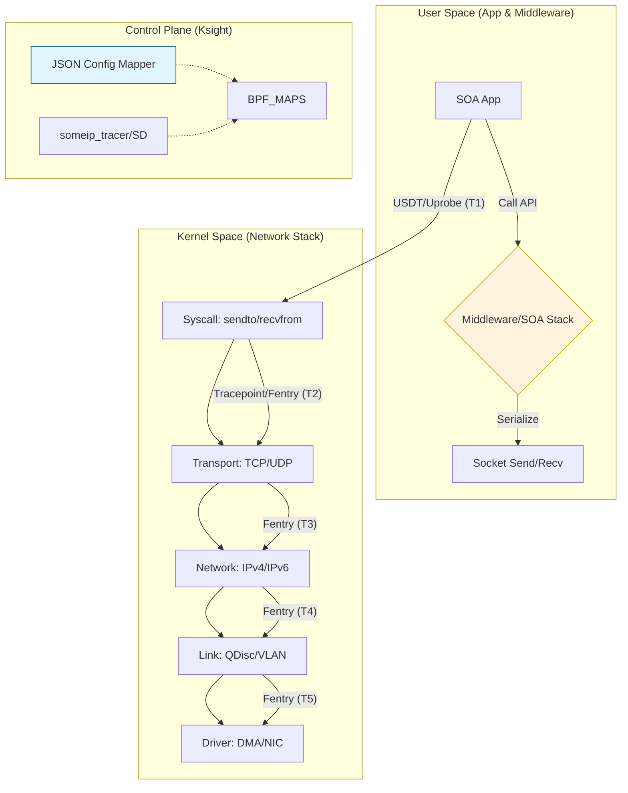

Created prompt.md

既然您需要一份专业、客观且可落地的技术设计方案，我将站在资深系统架构师的角度，结合 `ksight` 的现状（已有 `netwatcher`、`nettrace`、`ipcwatcher` 基础），为您制定这份**垂向全链路跟踪（Vertical Full-Link Tracing）技术方案**。

在动笔之前，我们需要明确：在不修改报文（无 TraceID）的情况下，**“五元组 + 报文特征（Payload Fingerprint/Session ID） + 线程上下文”** 是实现跨层串联的唯一可靠路径。

以下是详细的设计方案。

---

# 垂向全链路跟踪（Vertical Full-Link Tracing）技术设计方案

## 1. 逻辑拓扑与数据流向

全链路跟踪的核心是将散落在不同层级的“点”连成“线”。



---

## 2. 核心技术设计

### 2.1 跨层关联策略：基于“特征指纹”与“线程上下文”

在不修改业务报文的前提下，通过以下维度的复合关联实现精准映射：

#### (1) 映射逻辑 (The Mapping Engine)
*   **下行 (Tx Path)**：
    *   **L1 (App -> Syscall)**：通过 `uprobe/USDT` 捕获应用层 `ServiceID`，并记录当前 `TID`。在 BPF 中维护 `Map<TID, ServiceContext>`。
    *   **L2 (Syscall -> Kernel)**：当 `sys_enter_sendto` 触发时，通过 `TID` 从 Map 中取回 `ServiceContext`。此时报文尚未转化为 `skb`，但我们拥有了 `Buffer Pointer`。
    *   **L3 (Kernel 内)**：利用 `fentry/tcp_sendmsg` 捕获 `skb` 生成的瞬间。将 `skb` 内存地址（或 `skb->hash`）与 `ServiceContext` 绑定。
*   **上行 (Rx Path)**：
    *   **L1 (NIC -> IP)**：捕获 `netif_receive_skb`，提取五元组。
    *   **L2 (Payload Parsing)**：对于 SOME/IP 报文，BPF 探测器直接在内核态偏移解析 `ServiceID` 和 `SessionID` (前 16 字节)，将其作为该次请求的 **Unique TraceID**。

#### (2) eBPF Map 设计
```c
// 存储从 JSON 配置加载的静态映射：(IP, Port) -> ServiceInfo
struct {
    __uint(type, BPF_MAP_TYPE_HASH);
    __uint(max_entries, 1024);
    __type(key, struct endpoint_key); // {ip, port, proto}
    __type(value, struct soa_service_info); // {service_id, method_id, name[32]}
} soa_config_map SEC(".maps");

// 存储线程上下文（临时）：TID -> ServiceContext
struct {
    __uint(type, BPF_MAP_TYPE_HASH);
    __uint(max_entries, 256);
    __type(key, u32); // thread_id
    __type(value, struct trace_context); // 包含正在处理的 ServiceID, 起始时间
} thread_trace_map SEC(".maps");

// 存储 SKB 与业务上下文的绑定：SKB_Addr -> TraceSession
struct {
    __uint(type, BPF_MAP_TYPE_HASH);
    __uint(max_entries, 4096);
    __type(key, u64); // skb pointer
    __type(value, struct full_trace_info); // 各层时间戳、业务 ID
} skb_trace_map SEC(".maps");
```

---

### 2.2 内核协议栈精细化埋点清单

针对 PREEMPT_RT 环境，优先使用 `fentry/fexit`（需 5.5+ 内核）以降低开销。

| 监控层级 | 推荐 Hook 点 (Tx) | 推荐 Hook 点 (Rx) | 采集关键数据 |
| :--- | :--- | :--- | :--- |
| **System Call** | `fentry/__sys_sendto` | `fexit/__sys_recvfrom` | PID, TID, Buffer 地址 |
| **Transport** | `fentry/tcp_sendmsg` | `fexit/tcp_v4_rcv` | `sock` 指针, `skb` 指针 |
| **Network** | `fentry/ip_output` | `fentry/ip_rcv` | 五元组, `skb->len` |
| **Data Link** | `fentry/dev_queue_xmit` | `fexit/netif_receive_skb` | `ifindex`, `priority` |
| **Driver/NIC** | `fentry/ndo_start_xmit` | `tracepoint/napi/napi_poll` | 硬件队列 ID, DMA 时间 |

**PREEMPT_RT 环境下的抗干扰计算：**
在实时内核中，高优先级任务可能抢占 BPF 执行上下文。计算 Delta 时应使用 `bpf_ktime_get_ns()`（单调递增，不受 NTP 影响）。
*   **策略**：如果 Delta 时间超过预设阈值（如 >1ms），则标记该报文在内核中遭遇了 **“调度抢占”**（Scheduling Latency），而非网络协议栈瓶颈。

---

### 2.3 中间件与用户态插桩 (USDT)

中间件是全链路中最模糊的环。

*   **USDT 的应用**：
    中间件（如 vSOMEIP）若在关键位置定义了 USDT 埋点（例如 `vsomeip:message_serialized`），eBPF 可以极低损耗地捕获。
    *   **优势**：比 `uprobe` 稳定，不会因为函数内联（inline）导致失败，性能损失几乎为零（未开启时不执行）。
*   **Binding Logic (绑定逻辑)**：
    由于中间件往往采用多线程或线程池模型（如线程 A 接收，线程 B 处理，线程 C 回复），传统的 `TID` 映射会失效。
    *   **解决方案**：采用 **"Metadata Passing"**。在中间件层提取报文的 `Session ID`。在 BPF 中，将 `SessionID` 作为 Key 建立 Map，而非 `TID`。这样即使跨线程，只要报文特征一致，就能关联成功。

---

## 4. 性能风险预警 (Performance Warning)

1.  **Memory Overhead (Map 膨胀)**：
    车载网络中数据包吞吐量巨大。若对每个包都在 `skb_trace_map` 中记录，内存开销和垃圾回收压力极大。
    *   **对策**：实现 **“报文过滤白名单”**（仅跟踪特定 ServiceID 或 DstIP 的包）。
2.  **BPF Verifier Complexity (指令上限)**：
    在 BPF 中解析 SOME/IP 报文（L7 解析）会消耗大量指令数。
    *   **对策**：限制解析深度（仅解析固定偏移的 Header），不要尝试在内核中做复杂的逻辑业务解析。
3.  **Atomic context in PREEMPT_RT**：
    确保 BPF 程序不在持有不可抢占锁的上下文（如某些驱动路径）中进行重负荷计算。

---

## 5. 结论

**该计划的成功关键在于“化繁为简”：**
- 优先实现 **“(IP:Port) -> 静态业务名”** 的转义（解决 80% 的易用性问题）。
- 重点通过 **“SessionID/SeqID”** 在内核层提取唯一标识，解决跨层关联难题。
- 坚持作为研发工具，最大限度提高采样透明度，以换取诊断深度。

如果您认可此路线，我们可以先从 `netwatcher` 的 **“协议头特征提取 (Header Fingerprinting)”** 模块开始实现。