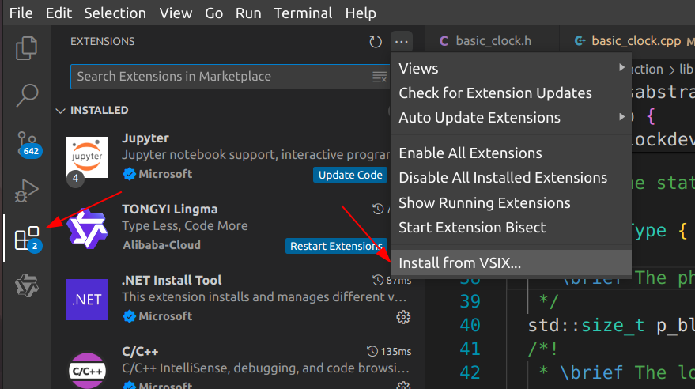

#  lmp vscode 插件使用指南

### 1. 运行效果


### 2. 安装与使用

#### 2.1 导入插件



安装成功如下：


#### 2.2 设置

- 启动grafana（可以在docker中启动），启动prometheus与BPF后端采集程序可以看到数据呈现
- 设置IP地址与端口，默认端口是`localhost:3000`
- 设置token


> [grafana官方_创建token](https://grafana.com/docs/grafana/latest/administration/service-accounts/#create-a-service-account-in-grafana)


设置可视化面板存放路径

> 注意：别忘记面板路径后面加 "/"


面板命名必须遵循如下规则:


若面板不存在，或路径，或名称不对，将出现如下错误提示：


### 3. 插件开发

#### 3.1 开发

安装yarn并且通过`yarn install`安装所需依赖

>  tips: 按 F5 开启调试

#### 3.2 开发注意事项

1. yo code生成的框架，vscode最小版本是1.90，需要修改为1.74，不然我当前的版本。1.89无法运行插件
2. tsconfig

```json
{
  "compilerOptions": {
    "module": "commonjs",   // 不要用Node16，不然命令会触发失败
    "target": "ES2021",
    "lib": ["ES2021"],
    "sourceMap": true,
    "rootDir": "src",
    "strict": true /* enable all strict type-checking options */
    /* Additional Checks */
    // "noImplicitReturns": true, /* Report error when not all code paths in function return a value. */
    // "noFallthroughCasesInSwitch": true, /* Report errors for fallthrough cases in switch statement. */
    // "noUnusedParameters": true,  /* Report errors on unused parameters. */
  }
}
```


